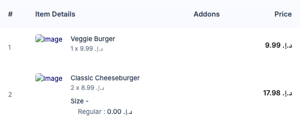
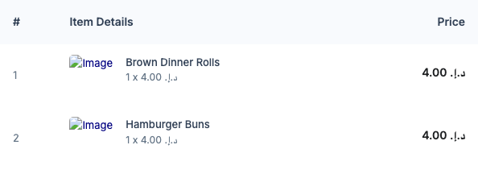

# QA Evidence — NEARS-3436

**PASS - Admin add_to_cart() session persistence fix verified live, both branches + edit-in-place + full place-order flow**

**2 screenshot(s).** Click any thumbnail for full resolution.

<table>
<tr>
<td align="center" width="33%"> ac1 ac2a food variation cart persisted order91133</td>
<td align="center" width="33%"> ac1 ac2b nonfood cart persisted order91216</td>
</tr>
</table>

### Other artifacts
- [`ac4-network-response-shapes.log`](ac4-network-response-shapes.log)

---
*From `nears/docs/qa-evidence/NEARS-3436/` · public-repo scrub policy (no live secrets; verified clean).*
