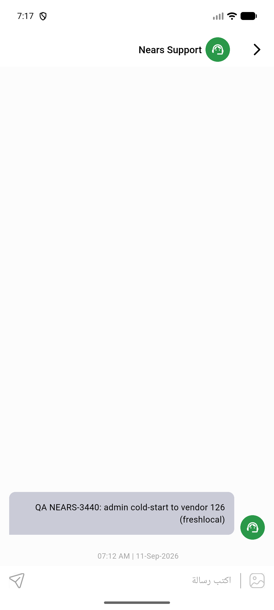

# QA Evidence — NEARS-3440

**PASS - all 3 ACs demonstrated live, backend fix confirmed via DB + VendorApp device pass**

**1 screenshot(s).** Click any thumbnail for full resolution.

<table>
<tr>
<td align="center" width="33%"> ac2 vendorapp chatscreen nears support</td>
</tr>
</table>

### Other artifacts
- [`ac1-ac3-db-verification.txt`](ac1-ac3-db-verification.txt)

---
*From `nears/docs/qa-evidence/NEARS-3440/` · public-repo scrub policy (no live secrets; verified clean).*
