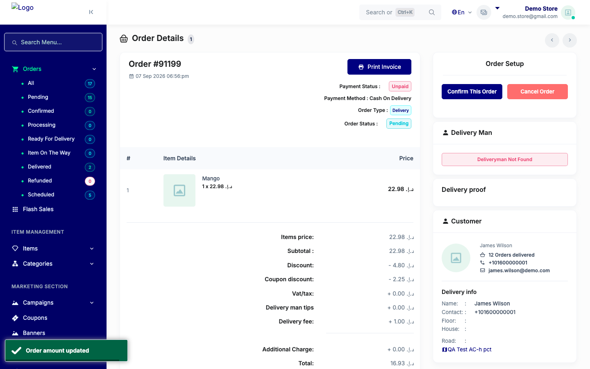
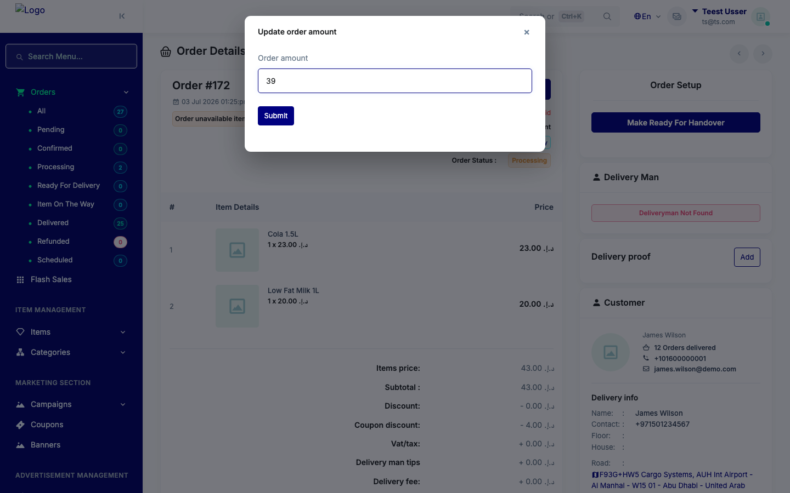
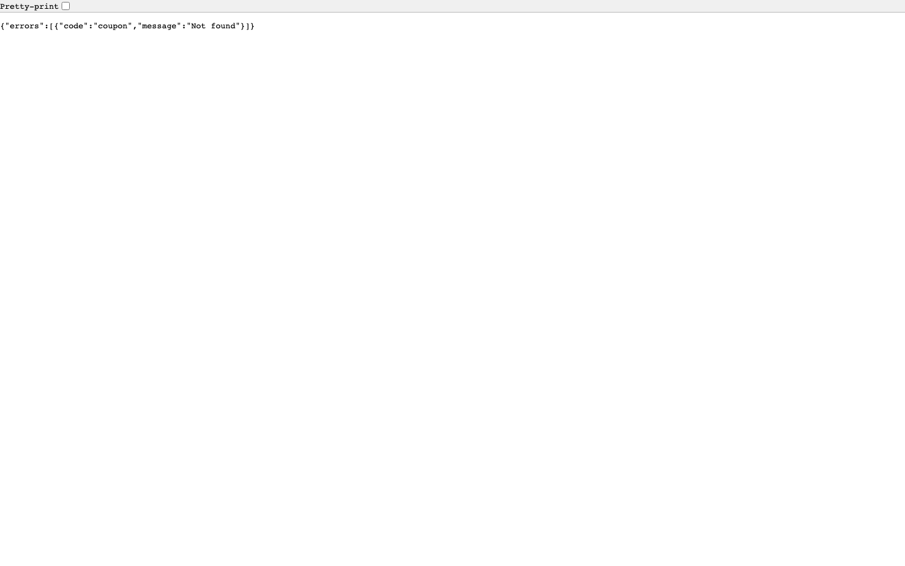

# QA Evidence — NEARS-3441

**PASS - AC1/AC2/AC3/regression demonstrated live; AC-add UNVERIFIABLE (Data DoR gap, automated-backstop PASS)**

**4 screenshot(s).** Click any thumbnail for full resolution.

<table>
<tr>
<td align="center" width="33%"> ac1 order91199 after submit success</td>
<td align="center" width="33%"> ac2 order172 modal filled before submit</td>
<td align="center" width="33%"> regression order91219 no coupon after submit</td>
</tr>
<tr>
<td align="center" width="33%"> supplementary order91200 min purchase 404path</td>
</tr>
</table>

### Other artifacts
- [`ac-add-module-mismatch-data-dor-gap.log`](ac-add-module-mismatch-data-dor-gap.log)
- [`ac2-order172-raw-http-407.log`](ac2-order172-raw-http-407.log)
- [`ac3-log-absence-check.log`](ac3-log-absence-check.log)

---
*From `nears/docs/qa-evidence/NEARS-3441/` · public-repo scrub policy (no live secrets; verified clean).*
