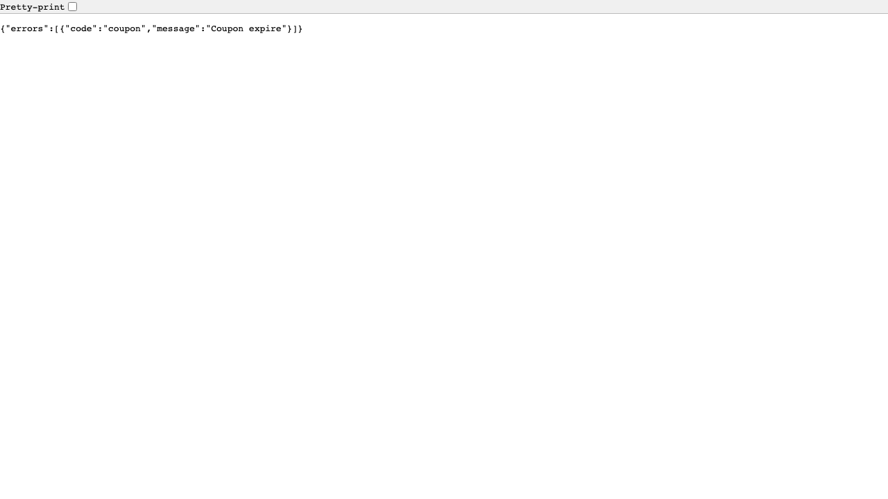
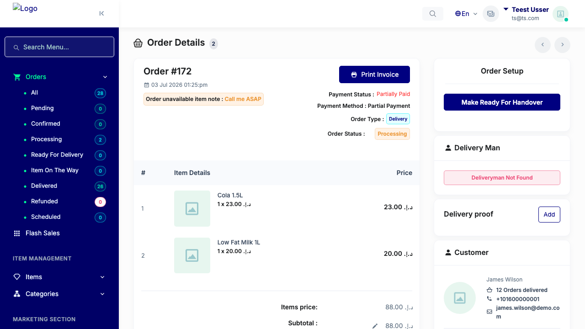

# QA Evidence — NEARS-3442

**PASS — coupon expire 407->422: HTTP 422/403 confirmed across 4 call sites, real-browser proxy-auth interstitial eliminated, regression sweep clean**

**2 screenshot(s).** Click any thumbnail for full resolution.

<table>
<tr>
<td align="center" width="33%"> ac2 ac3 browser expired coupon</td>
<td align="center" width="33%"> order details after clean</td>
</tr>
</table>

### Other artifacts
- [`ac1-raw-http.log`](ac1-raw-http.log)
- [`regression-sweep.log`](regression-sweep.log)

---
*From `nears/docs/qa-evidence/NEARS-3442/` · public-repo scrub policy (no live secrets; verified clean).*
