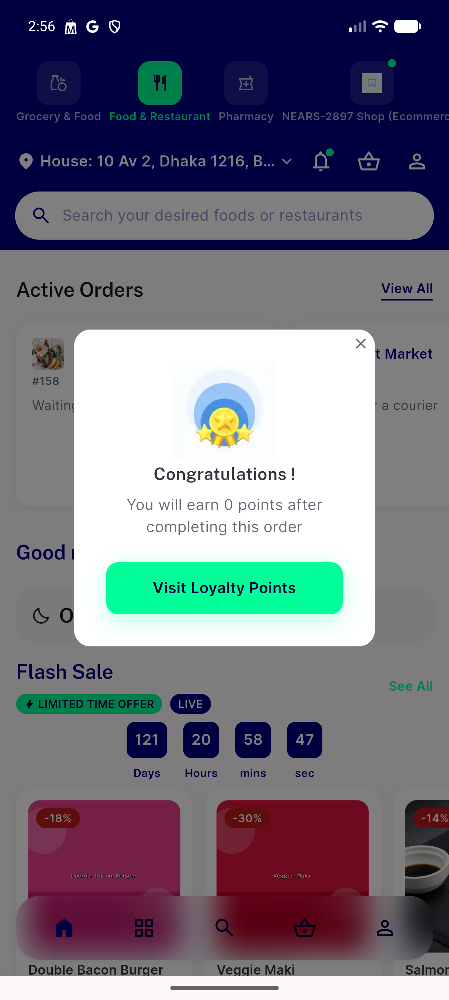
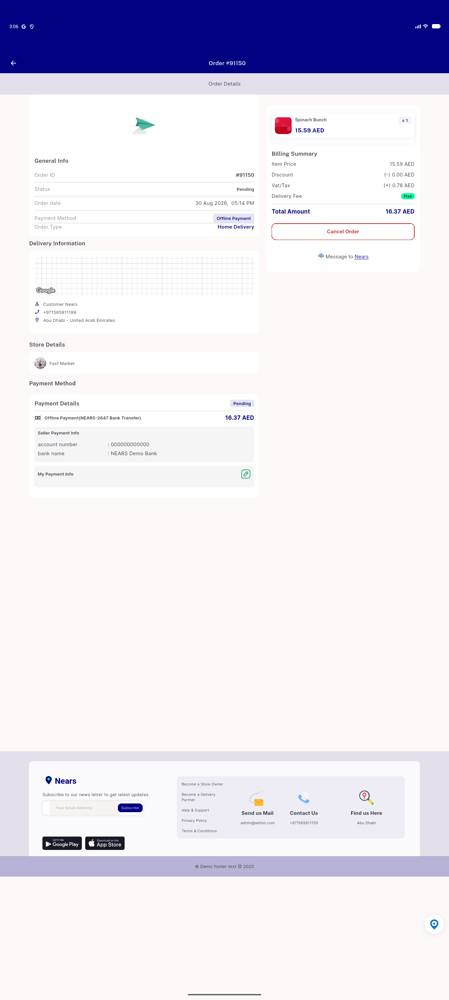
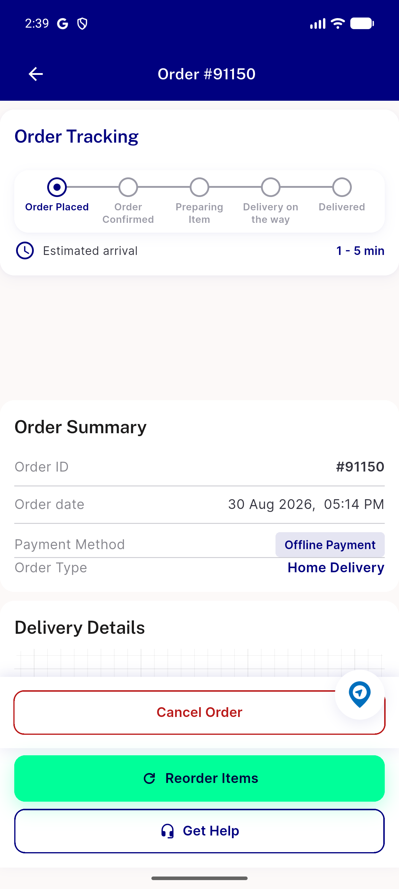
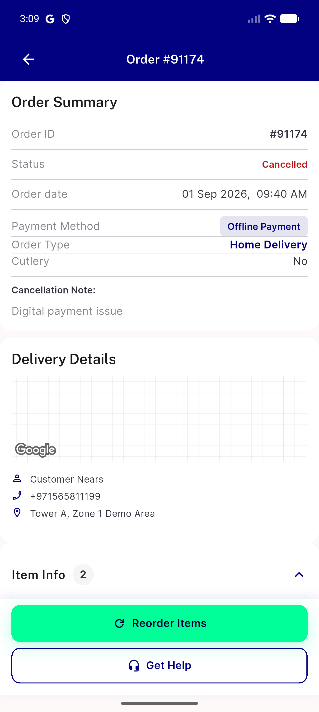
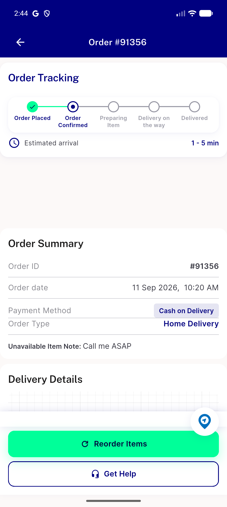

# QA Evidence — NEARS-3443

**PASS (with 3/4 call-site reachability caveat, see comment) - AC1 974066/1000000 bytes, AC4 orphans clean, AC2/AC3 verified at congratulation_dialogue.dart 100dp**

**5 screenshot(s).** Click any thumbnail for full resolution.

<table>
<tr>
<td align="center" width="33%"> ac2 ac3 congratulation dialogue 100dp</td>
<td align="center" width="33%"> ac2 banner isdesktop path different layout</td>
<td align="center" width="33%"> ac2 banner unreachable order91150 pending food</td>
</tr>
<tr>
<td align="center" width="33%"> ac2 banner unreachable order91174 canceled food</td>
<td align="center" width="33%"> ac2 banner unreachable order91356 confirmed grocery</td>
</tr>
</table>

---
*From `nears/docs/qa-evidence/NEARS-3443/` · public-repo scrub policy (no live secrets; verified clean).*
