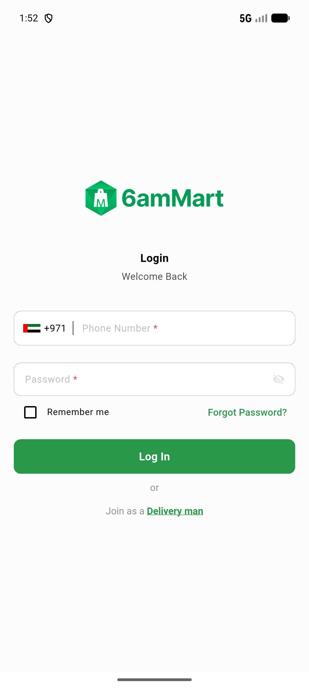
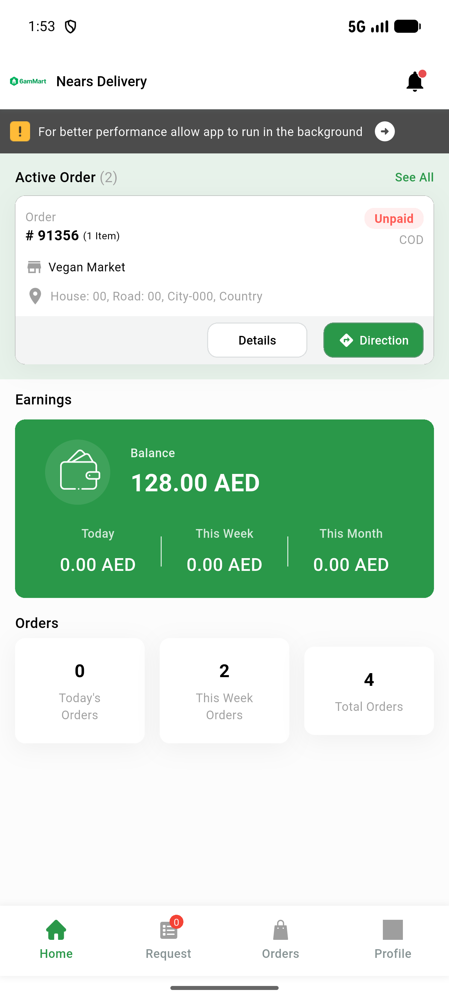

# QA Evidence — NEARS-3446

**PASS — DeliveryApp stale-login-state fix verified live: AC1/AC2 no 401 loop/stale isLoggedIn on cold-start-after-kill, AC3 at most 1 logout call (double-tap + kill race both confirmed single-fire), AC4 unaffected**

**2 screenshot(s).** Click any thumbnail for full resolution.

<table>
<tr>
<td align="center" width="33%"> ac1 ac2 coldstart after kill signin</td>
<td align="center" width="33%"> ac4 normal coldstart dashboard</td>
</tr>
</table>

---
*From `nears/docs/qa-evidence/NEARS-3446/` · public-repo scrub policy (no live secrets; verified clean).*
