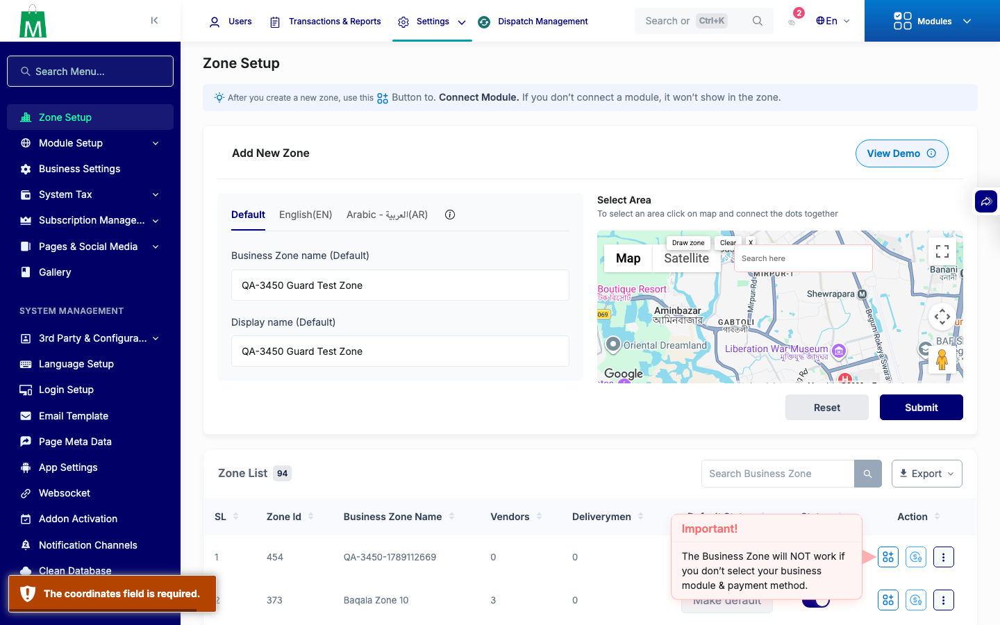
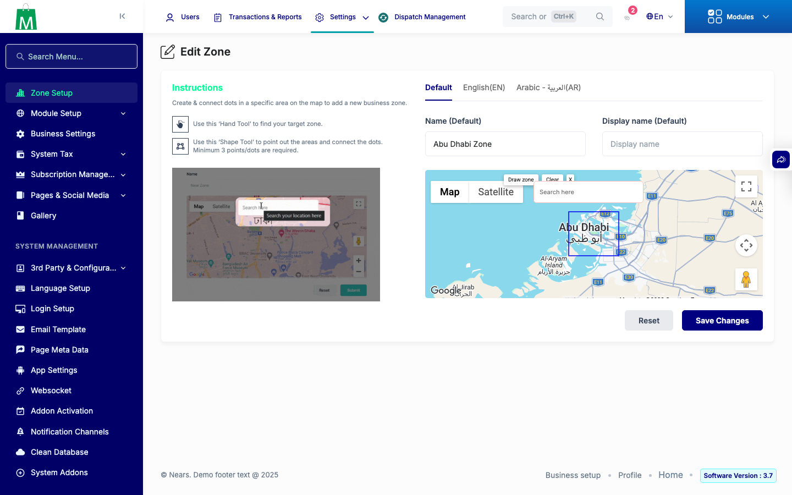
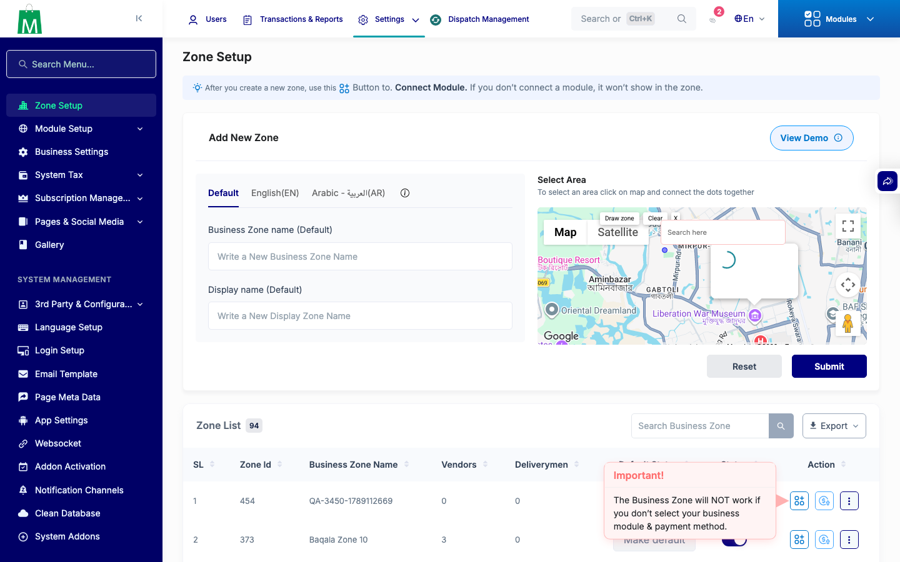
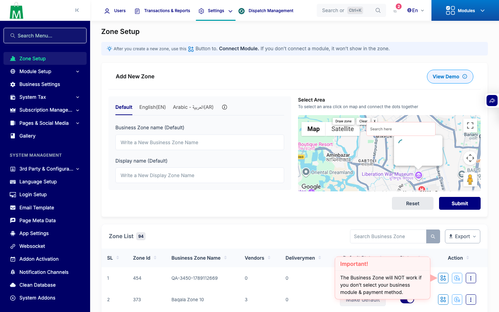

# QA Evidence — NEARS-3450

**Delta re-QA PASS: lastpolygon null-guard (35a0df5ed) — no throw pre-draw Reset/Submit on create+edit, happy-path clear intact**

**6 screenshot(s).** Click any thumbnail for full resolution.

<table>
<tr>
<td align="center" width="33%"> step1 create reset before draw</td>
<td align="center" width="33%"> step2 create submit before draw</td>
<td align="center" width="33%"> step3 edit reset before draw</td>
</tr>
<tr>
<td align="center" width="33%"> step4a after draw</td>
<td align="center" width="33%"> step4b after reset</td>
<td align="center" width="33%"> step5 zone list</td>
</tr>
</table>

---
*From `nears/docs/qa-evidence/NEARS-3450/` · public-repo scrub policy (no live secrets; verified clean).*
