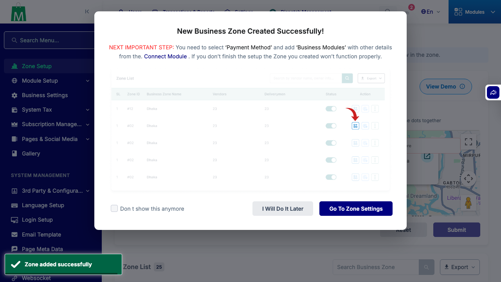
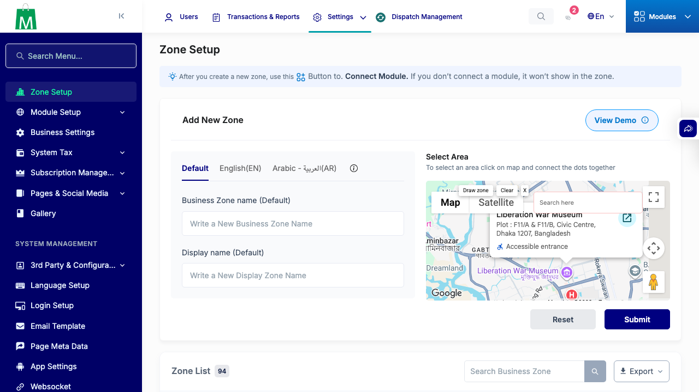
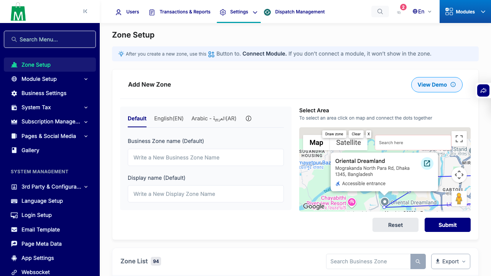
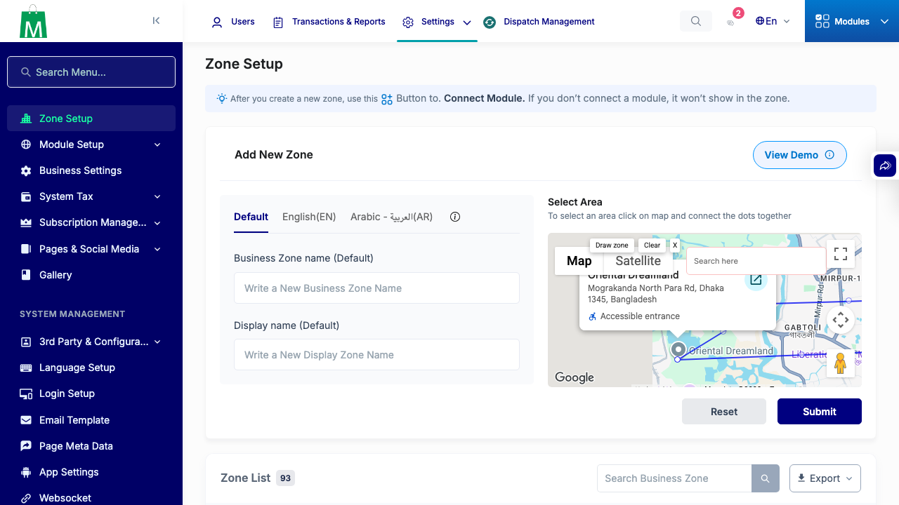
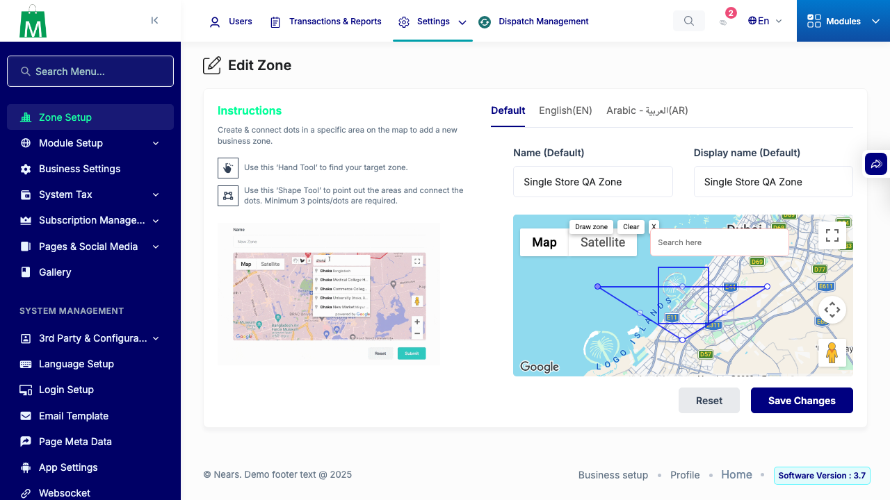
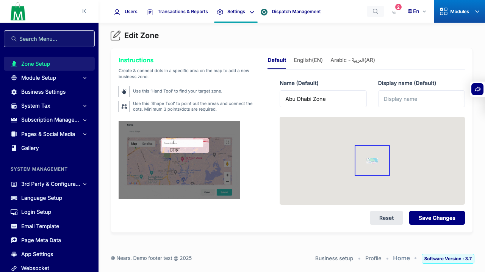
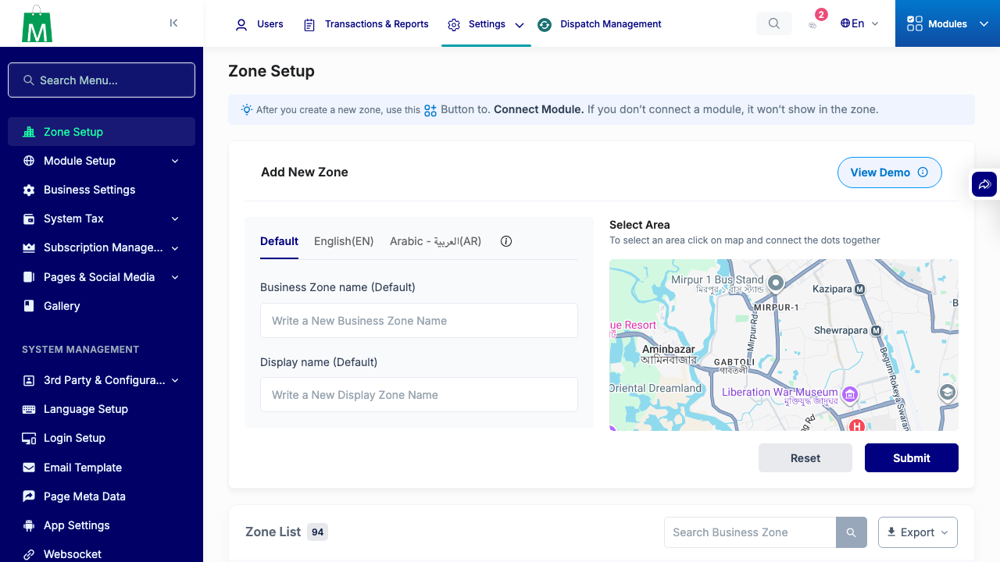

# QA Evidence — NEARS-3450

**QA PASS -- zone draw tool (DrawingManager replacement)**

**10 screenshot(s).** Click any thumbnail for full resolution.

<table>
<tr>
<td align="center" width="33%"> ac1 after submit</td>
<td align="center" width="33%"> ac1 clear reset controls</td>
<td align="center" width="33%"> ac1 drag vertex</td>
</tr>
<tr>
<td align="center" width="33%"> ac1 draw preview</td>
<td align="center" width="33%"> ac1 zero click abort</td>
<td align="center" width="33%"> ac2 edit draw replace zone3</td>
</tr>
<tr>
<td align="center" width="33%"> ac2 edit load zone2</td>
<td align="center" width="33%"> debug after submit</td>
<td align="center" width="33%"> debug mid draw</td>
</tr>
<tr>
<td align="center" width="33%"> regression zone list</td>
</tr>
</table>

### Other artifacts
- [`bug-marker-dblclick-headless-flake.log`](bug-marker-dblclick-headless-flake.log)
- [`roundtrip-gate1-results.json`](roundtrip-gate1-results.json)

---
*From `nears/docs/qa-evidence/NEARS-3450/` · public-repo scrub policy (no live secrets; verified clean).*
