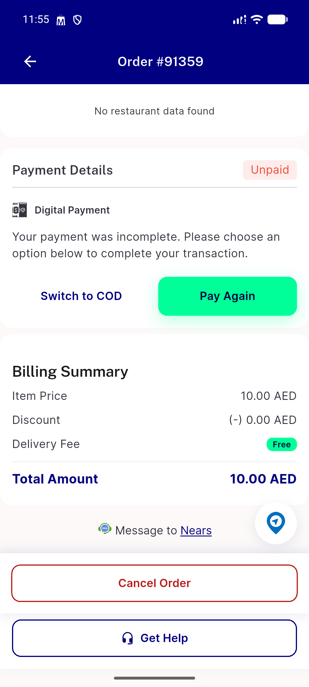
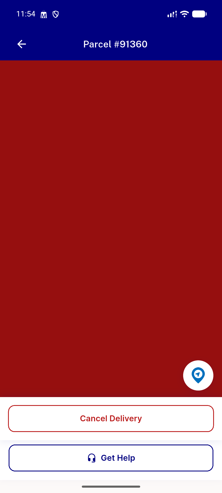
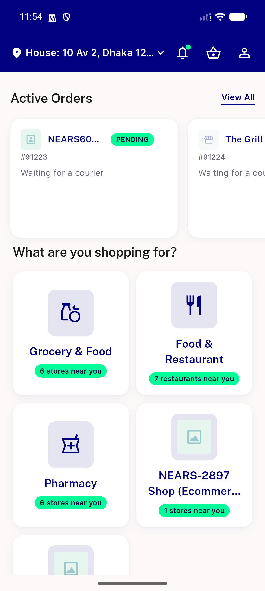

# QA Evidence — NEARS-3454

**PASS — cod_eligible boolean replaces raw pivot cap leak; boundary/null/zero/parcel all verified live**

**3 screenshot(s).** Click any thumbnail for full resolution.

<table>
<tr>
<td align="center" width="33%"> ac2 ineligible overcap 91359 still unpaid digital</td>
<td align="center" width="33%"> ac2 ineligible overcap blocked generic snackbar</td>
<td align="center" width="33%"> item5 parcel override switch success</td>
</tr>
</table>

### Other artifacts
- [`ac1-api-json-boundary-matrix.log`](ac1-api-json-boundary-matrix.log)

---
*From `nears/docs/qa-evidence/NEARS-3454/` · public-repo scrub policy (no live secrets; verified clean).*
