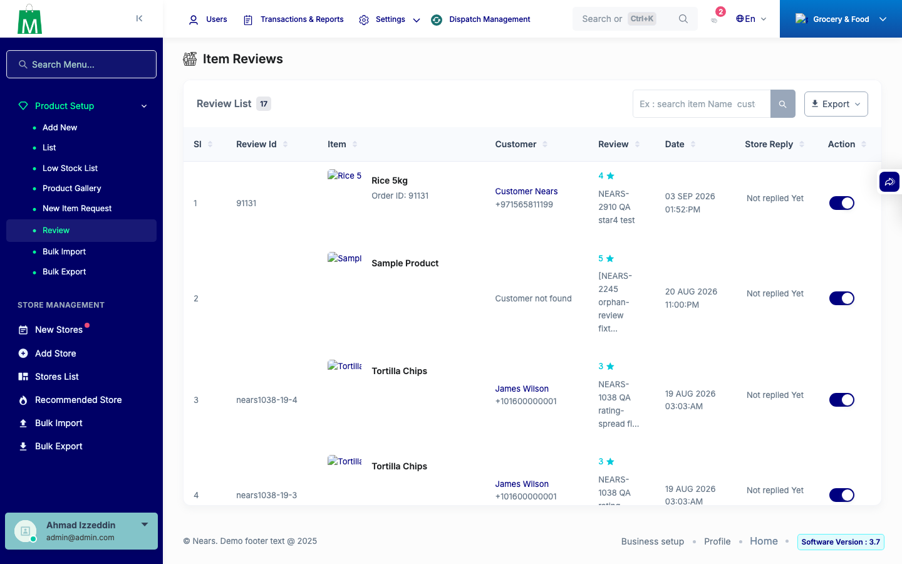
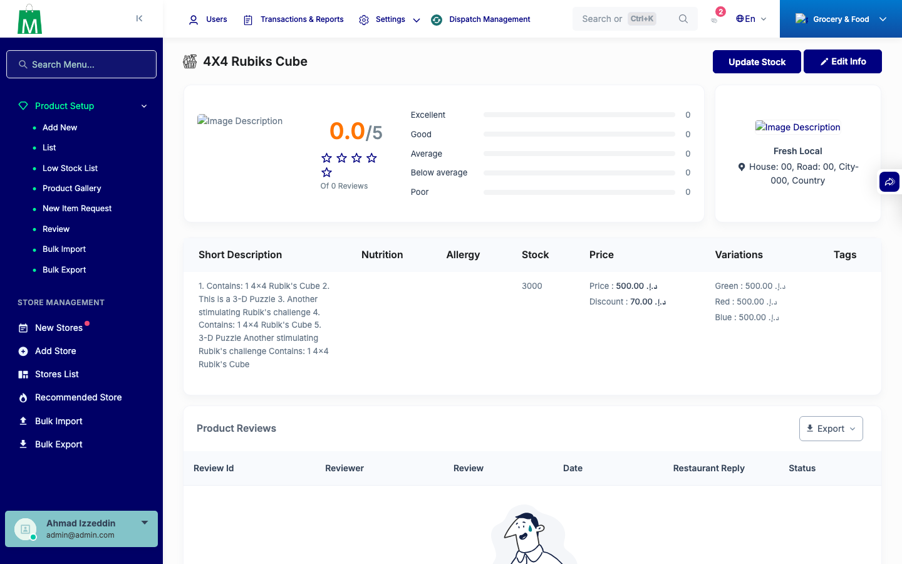
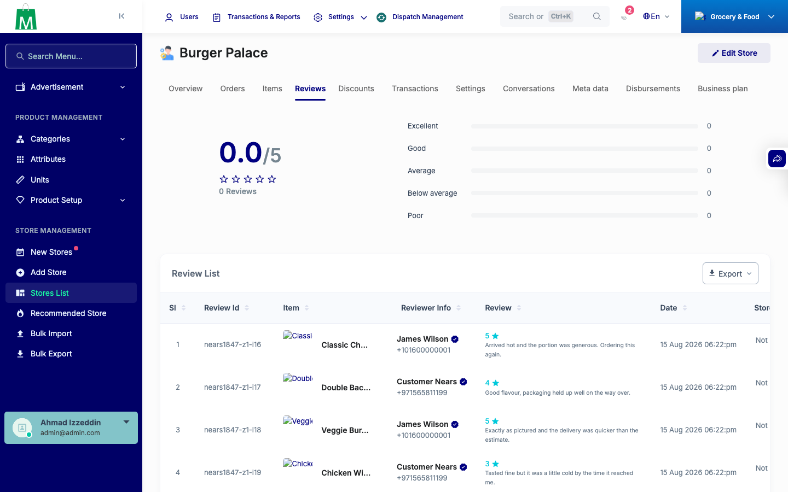
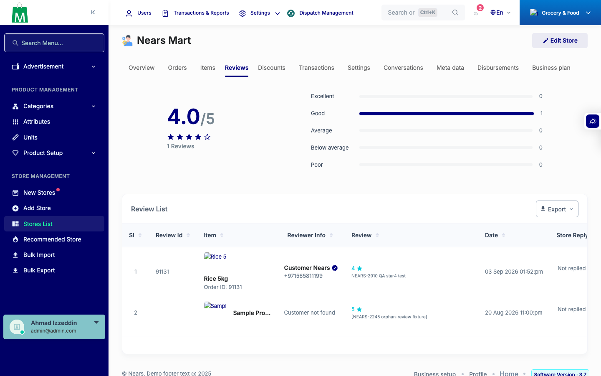

# QA Evidence — NEARS-3456

**PASS — review.blade.php null-safe order_id guard verified live, _review-table.blade.php deletion confirmed zero-breakage**

**4 screenshot(s).** Click any thumbnail for full resolution.

<table>
<tr>
<td align="center" width="33%"> ac1 item reviews list no break</td>
<td align="center" width="33%"> ac1 product view 86 no break</td>
<td align="center" width="33%"> ac2 store4 null orderid no500</td>
</tr>
<tr>
<td align="center" width="33%"> ac3 store1 valid orderid link</td>
</tr>
</table>

### Other artifacts
- [`bug-filemanager-index-500-preexisting.log`](bug-filemanager-index-500-preexisting.log)

---
*From `nears/docs/qa-evidence/NEARS-3456/` · public-repo scrub policy (no live secrets; verified clean).*
