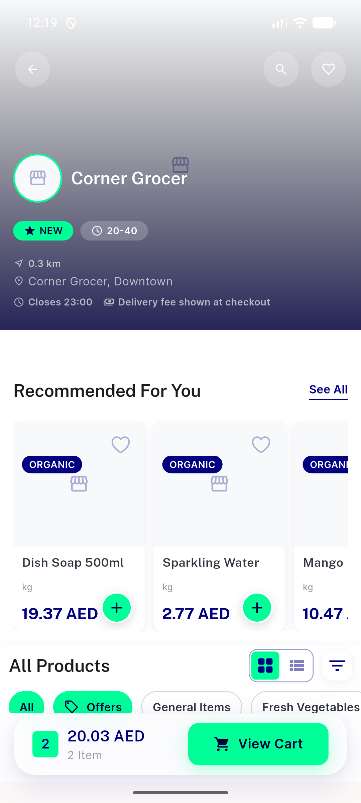
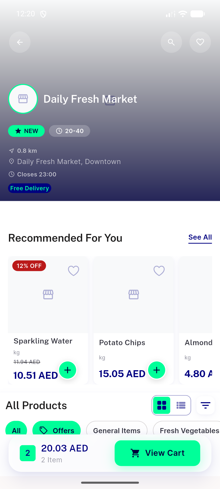
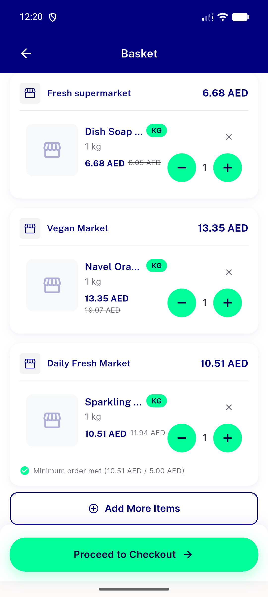
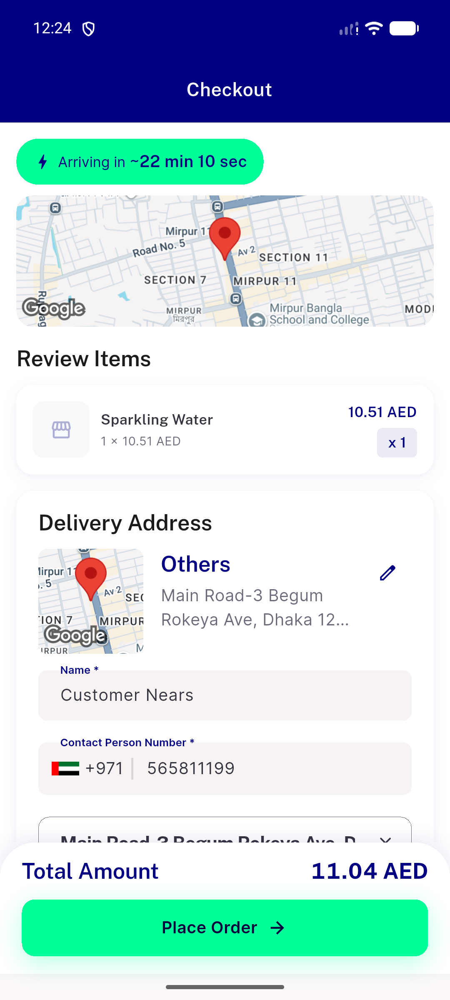
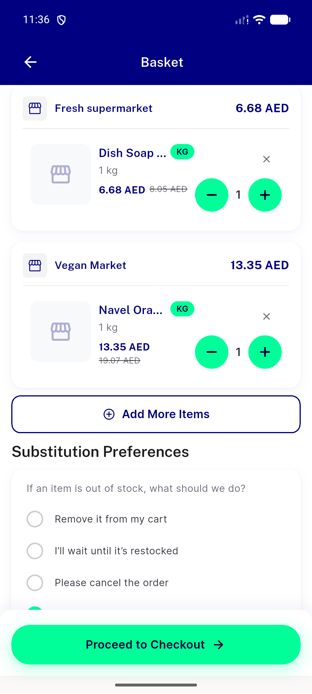
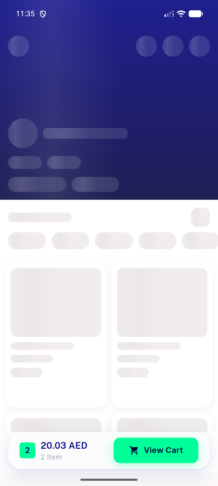
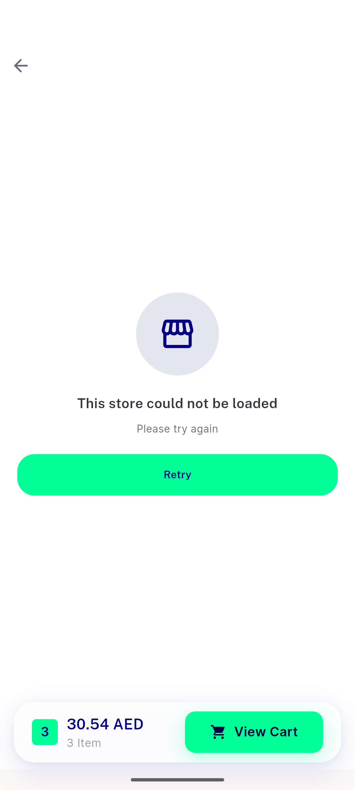

# QA Evidence — NEARS-3464

**PASS — fix-cycle 2 delta re-QA: AC2 (crash-free fresh-fetch load on store+cart screens) and AC3 (finally fires once) demonstrated live on emulator-5566, 2 distinct stores, full store<->cart<->checkout sweep clean**

**7 screenshot(s).** Click any thumbnail for full resolution.

<table>
<tr>
<td align="center" width="33%"> ac2a store1 corner grocer</td>
<td align="center" width="33%"> ac2a store2 daily fresh market</td>
<td align="center" width="33%"> ac2b cart screen</td>
</tr>
<tr>
<td align="center" width="33%"> ac3 checkout happy path</td>
<td align="center" width="33%"> bug cart screen uncaught setstate during build</td>
<td align="center" width="33%"> bug fresh fetch update throws flutter error</td>
</tr>
<tr>
<td align="center" width="33%"> regression multistore cart back load failure</td>
</tr>
</table>

### Other artifacts
- [`bug-cart-screen-uncaught-setstate-during-build.log`](bug-cart-screen-uncaught-setstate-during-build.log)
- [`bug-fresh-fetch-update-throws-flutter-error.log`](bug-fresh-fetch-update-throws-flutter-error.log)
- [`progress.md`](progress.md)

---
*From `nears/docs/qa-evidence/NEARS-3464/` · public-repo scrub policy (no live secrets; verified clean).*
