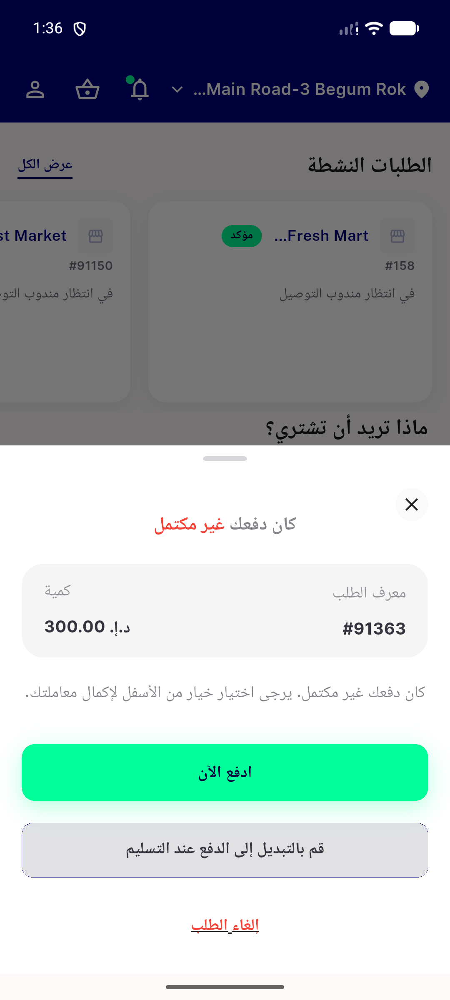
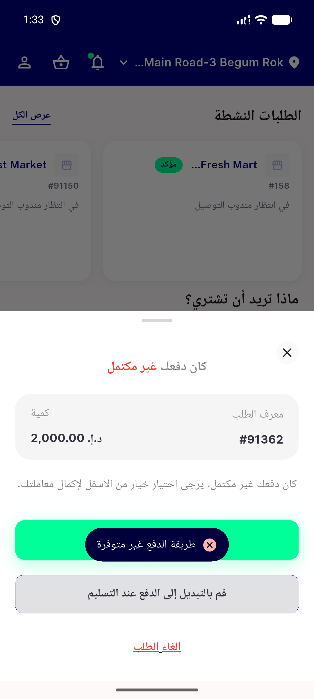
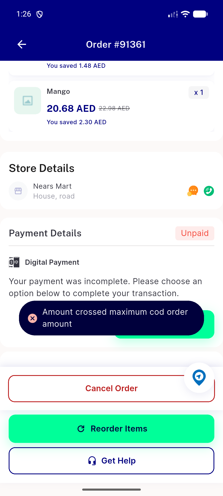
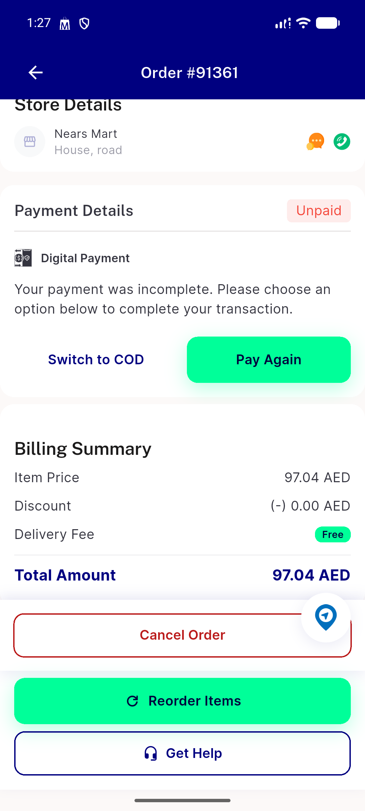

# QA Evidence — NEARS-3467

**PASS — COD cap bypass fixed; server-side gate verified live (API + backend), client rejection message surfaced verified live (UserApp, incl. RTL/Arabic); phpunit 7/7, flutter test 111/111, flutter analyze clean**

**4 screenshot(s).** Click any thumbnail for full resolution.

<table>
<tr>
<td align="center" width="33%"> ac rtl arabic cod cap error snackbar v2</td>
<td align="center" width="33%"> ac1 rtl arabic cod cap error snackbar</td>
<td align="center" width="33%"> ac1 userapp cod cap error snackbar</td>
</tr>
<tr>
<td align="center" width="33%"> ac2 userapp cod switch success</td>
</tr>
</table>

---
*From `nears/docs/qa-evidence/NEARS-3467/` · public-repo scrub policy (no live secrets; verified clean).*
