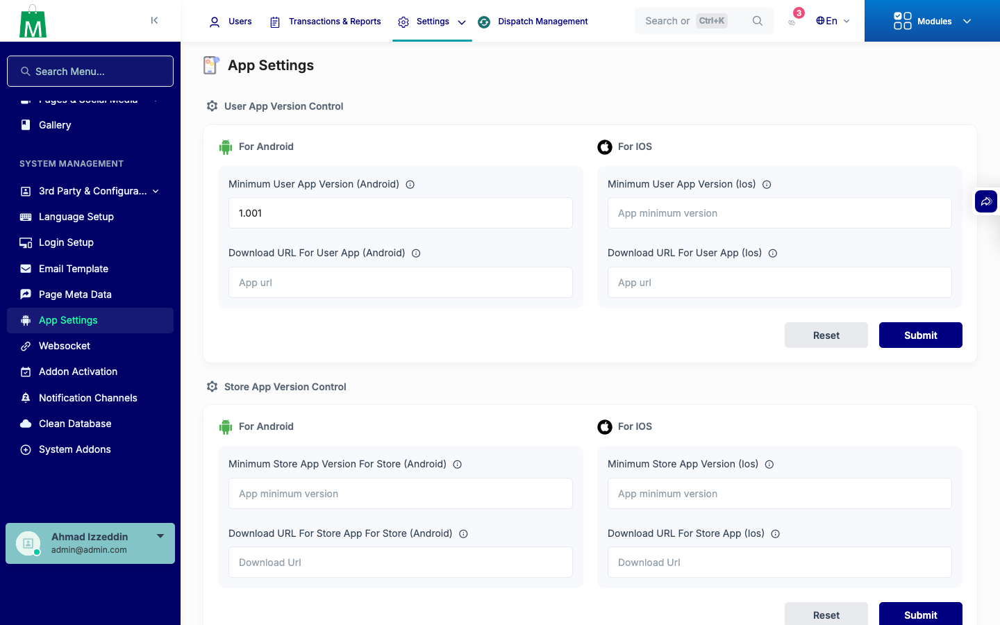
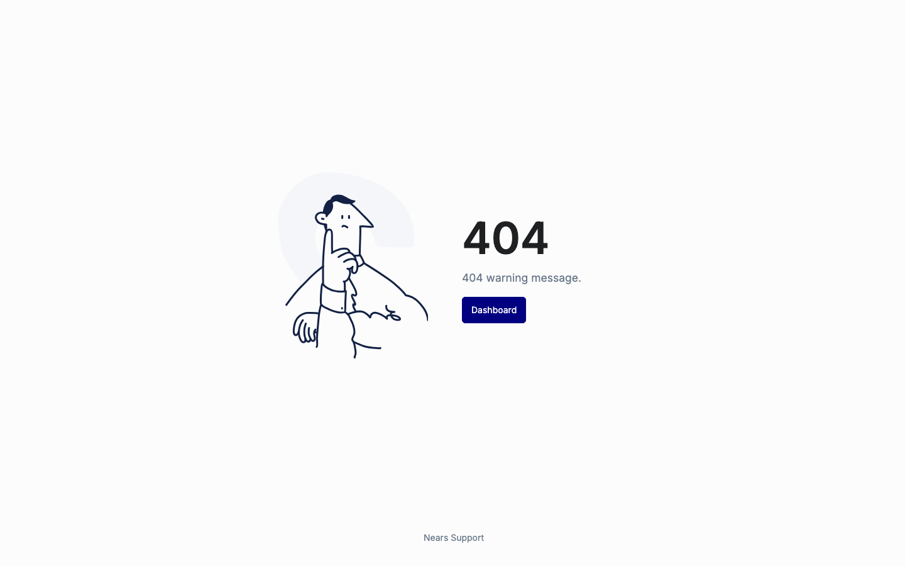
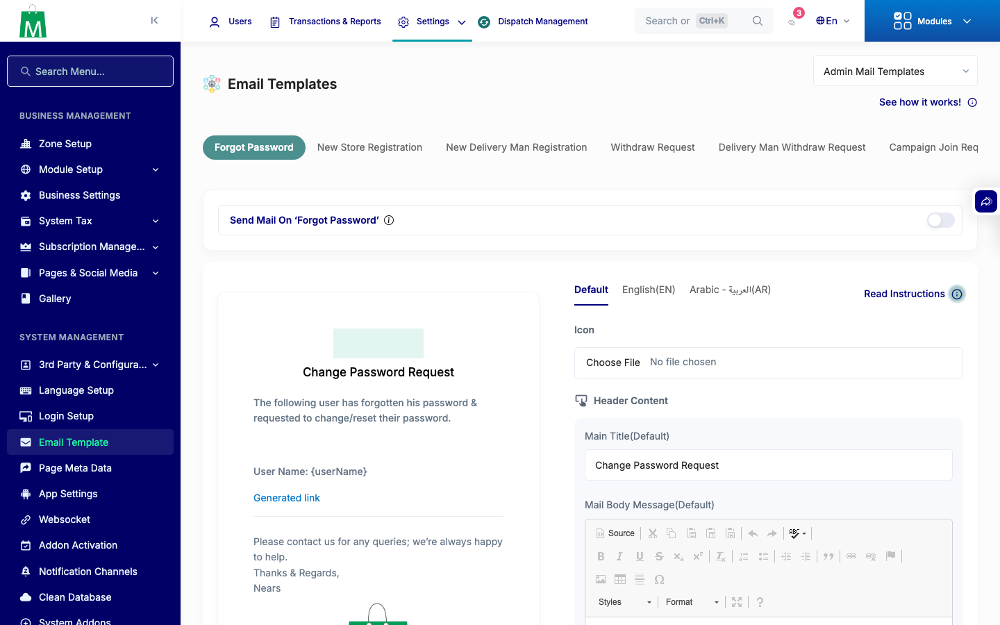
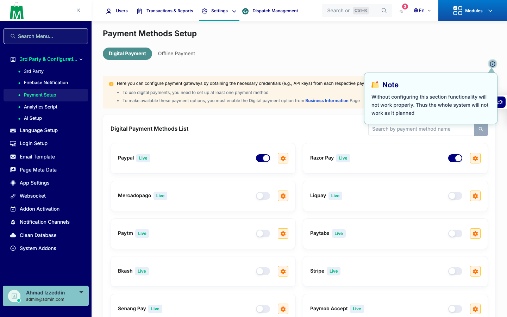

# QA Evidence — NEARS-3470

**PASS — AC1 route-name dedup verified live (route:cache clean + GET/POST end-to-end for App Settings, Email Setup, Custom Role); AC2 SslCommerzPaymentController null-guard + forged-callback security gate verified (route:list clean + automated test passes)**

**5 screenshot(s).** Click any thumbnail for full resolution.

<table>
<tr>
<td align="center" width="33%"> ac1 app settings get</td>
<td align="center" width="33%"> ac1 app settings post saved</td>
<td align="center" width="33%"> ac1 custom role created</td>
</tr>
<tr>
<td align="center" width="33%"> ac1 email setup post saved</td>
<td align="center" width="33%"> ac2 payment setup loads</td>
</tr>
</table>

### Other artifacts
- [`bug-email-setup-missing-tab-500.log`](bug-email-setup-missing-tab-500.log)

---
*From `nears/docs/qa-evidence/NEARS-3470/` · public-repo scrub policy (no live secrets; verified clean).*
