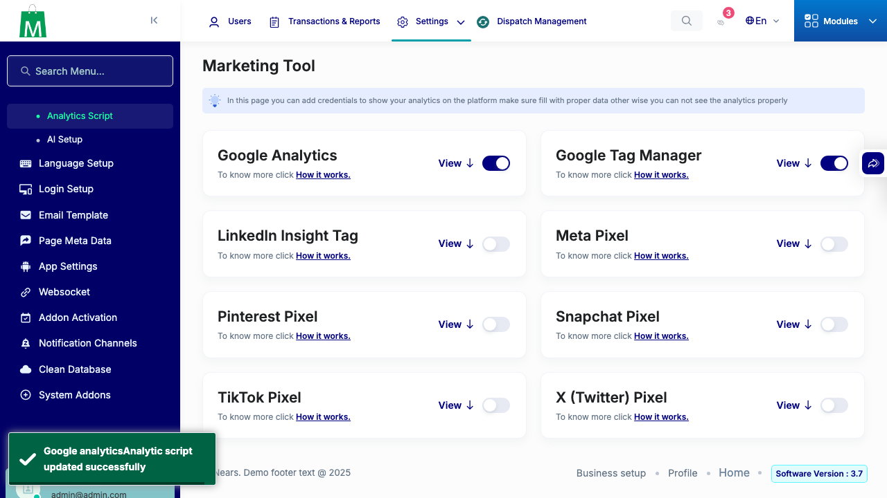

# QA Evidence — NEARS-3471

**PASS — AC2 live save demonstrated, no cache flush; AC1 regression backstop 14/14 green**

**1 screenshot(s).** Click any thumbnail for full resolution.

<table>
<tr>
<td align="center" width="33%"> ac2 save toast</td>
</tr>
</table>

---
*From `nears/docs/qa-evidence/NEARS-3471/` · public-repo scrub policy (no live secrets; verified clean).*
