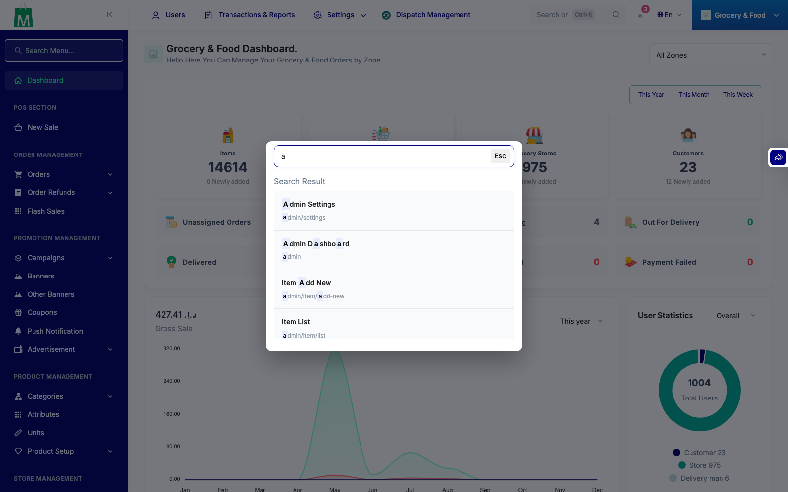

# QA Evidence — NEARS-3472

**PASS — AC1 live demo: bounded global search (limit 50/resolver), no 500/memory exhaustion; regression: specific keyword still returns correct match. AC2/AC3 code-verified PASS.**

**1 screenshot(s).** Click any thumbnail for full resolution.

<table>
<tr>
<td align="center" width="33%"> ac1 broad keyword bounded</td>
</tr>
</table>

### Other artifacts
- [`ac1-broad-keyword-response.log`](ac1-broad-keyword-response.log)
- [`ac1-regression-specific-keyword-response.log`](ac1-regression-specific-keyword-response.log)

---
*From `nears/docs/qa-evidence/NEARS-3472/` · public-repo scrub policy (no live secrets; verified clean).*
