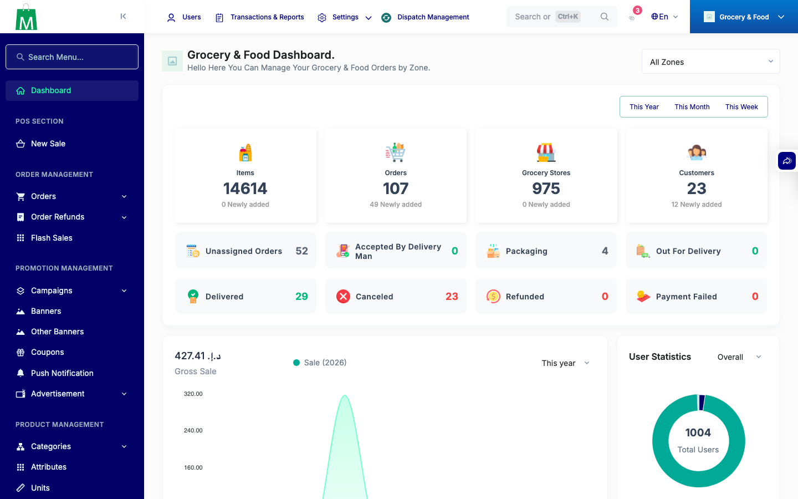
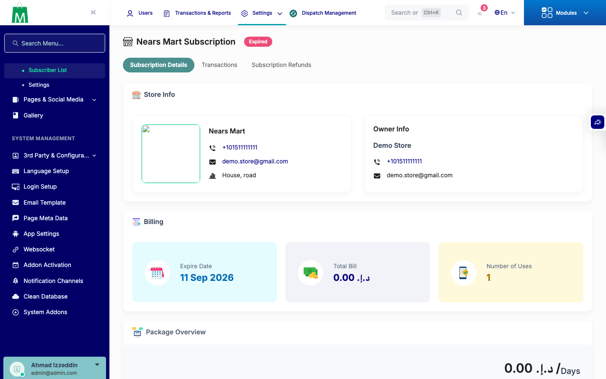
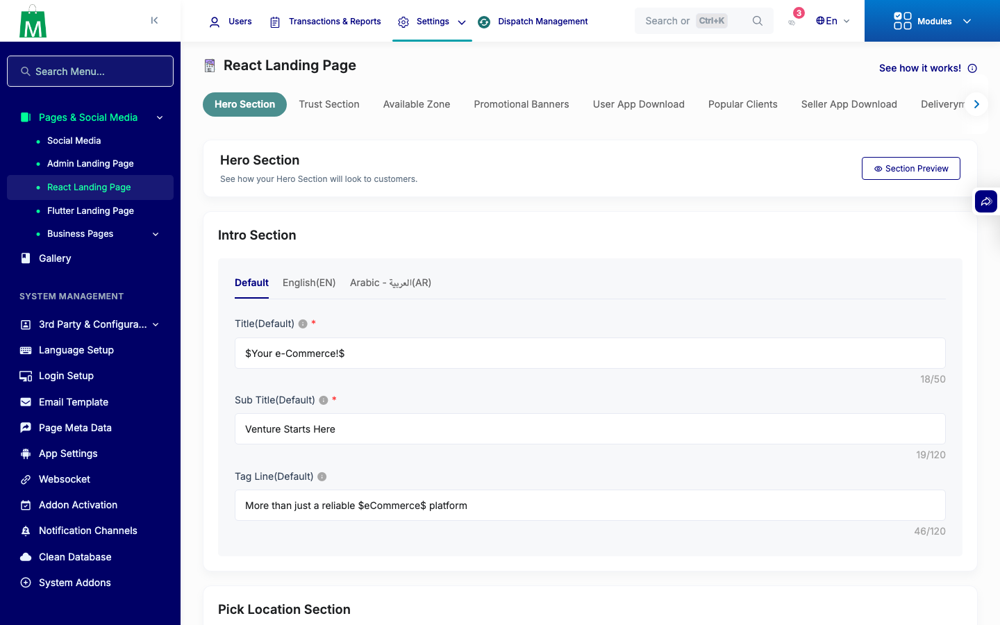

# QA Evidence — NEARS-3474

**PASS — 6-item backend dead-code/dev-env-residue hygiene bundle, AC1-AC6 verified live; 1 pre-existing unrelated OOM finding on /admin/search-routing under CLI dev-server 128M memory_limit (regression_bug, not caused by this diff)**

**3 screenshot(s).** Click any thumbnail for full resolution.

<table>
<tr>
<td align="center" width="33%"> ac smoke dashboard</td>
<td align="center" width="33%"> ac2 subscriber detail</td>
<td align="center" width="33%"> ac4 react landing header</td>
</tr>
</table>

### Other artifacts
- [`bug-search-routing-oom-cli-devserver.log`](bug-search-routing-oom-cli-devserver.log)

---
*From `nears/docs/qa-evidence/NEARS-3474/` · public-repo scrub policy (no live secrets; verified clean).*
