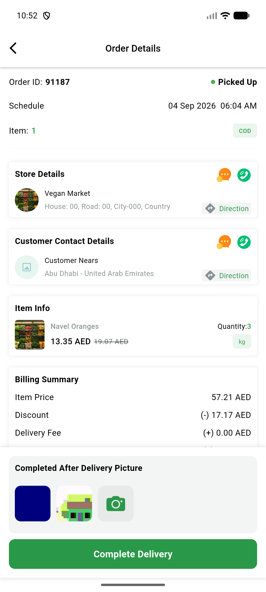
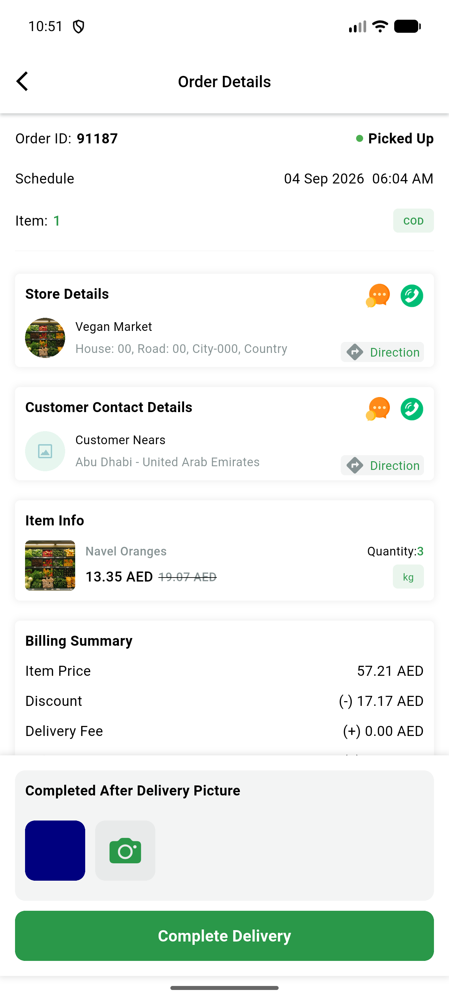
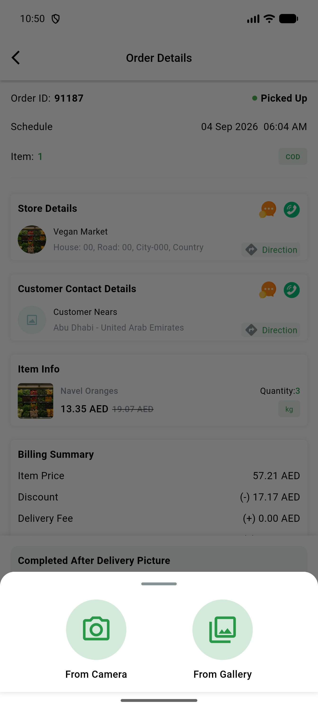
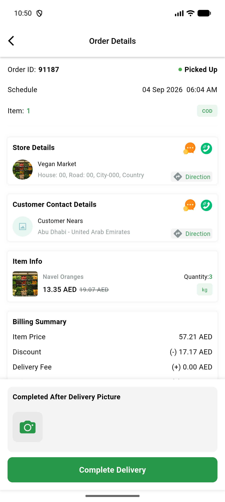
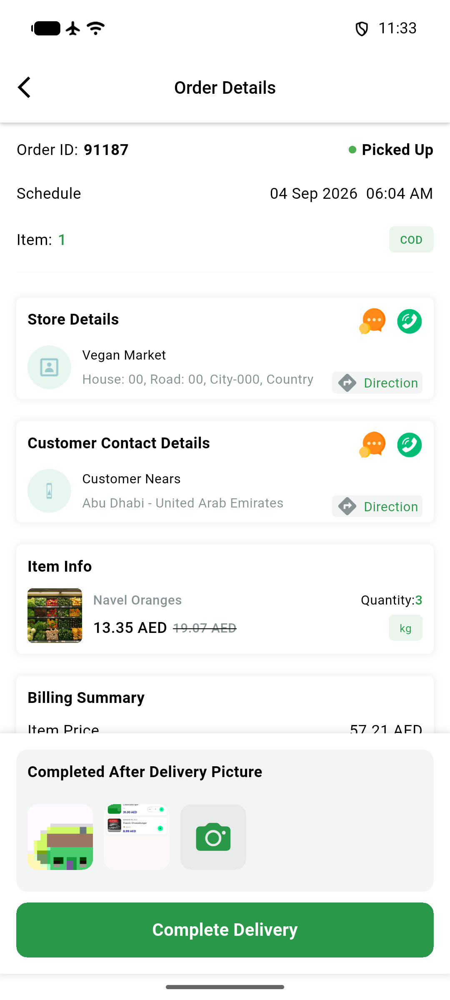
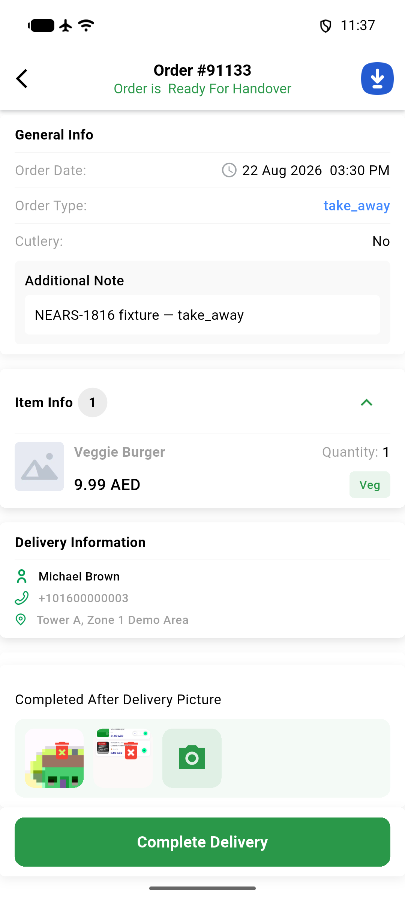

# QA Evidence — NEARS-3477

**Delta re-QA PASS: post-merge (ccb3166dc) live spot-check of 3 CameraButtonSheetWidget call sites — DeliveryApp confirmation picker + VendorApp order-details picker + VendorApp DialogImageWidget picker, all camera+gallery paths working, logs clean**

**6 screenshot(s).** Click any thumbnail for full resolution.

<table>
<tr>
<td align="center" width="33%"> deliveryapp after camera and gallery 2pics</td>
<td align="center" width="33%"> deliveryapp after gallery pick</td>
<td align="center" width="33%"> deliveryapp camerabuttonsheet open</td>
</tr>
<tr>
<td align="center" width="33%"> deliveryapp order91187 before picker</td>
<td align="center" width="33%"> deltaqa deliveryapp confirmation picker</td>
<td align="center" width="33%"> deltaqa vendorapp order details picker</td>
</tr>
</table>

### Other artifacts
- [`bug-vendorapp-orderhistory-nullcheck-crash.log`](bug-vendorapp-orderhistory-nullcheck-crash.log)
- [`deliveryapp-order91187-after-camera-and-gallery.xml`](deliveryapp-order91187-after-camera-and-gallery.xml)
- [`notes-deliveryapp-picker-REACHED.log`](notes-deliveryapp-picker-REACHED.log)
- [`notes-deliveryapp-picker-unreached.log`](notes-deliveryapp-picker-unreached.log)
- [`userapp-checkout-after-camera-pick-2remove.xml`](userapp-checkout-after-camera-pick-2remove.xml)
- [`userapp-checkout-after-gallery-pick.xml`](userapp-checkout-after-gallery-pick.xml)
- [`userapp-checkout-after-remove.xml`](userapp-checkout-after-remove.xml)
- [`vendorapp-order-91133-before-swipe.xml`](vendorapp-order-91133-before-swipe.xml)
- [`vendorapp-take-a-picture-dialog.xml`](vendorapp-take-a-picture-dialog.xml)

---
*From `nears/docs/qa-evidence/NEARS-3477/` · public-repo scrub policy (no live secrets; verified clean).*
