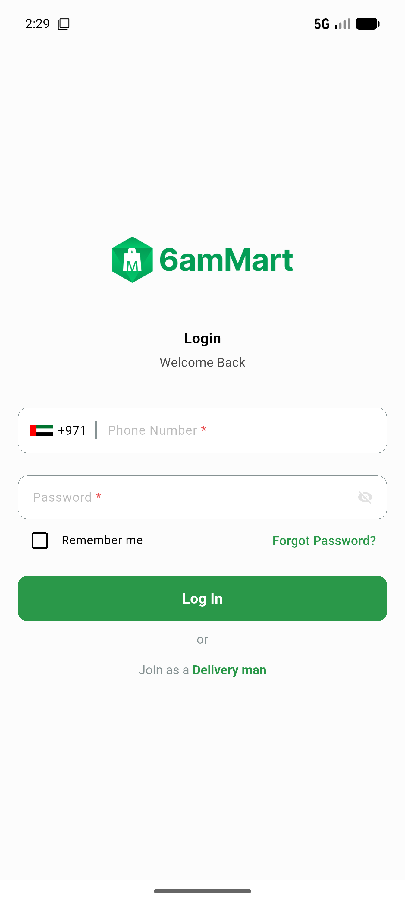

# QA Evidence — NEARS-3479

**PASS — AC1-AC4 hygiene bundle: doc fix, analyzer excludes, clock DI seam, qa-run.sh --dart-define**

**2 screenshot(s).** Click any thumbnail for full resolution.

<table>
<tr>
<td align="center" width="33%"> ac3 deliveryapp boot</td>
<td align="center" width="33%"> ac3 vendorapp boot</td>
</tr>
</table>

### Other artifacts
- [`ac4-dart-define-exec.log`](ac4-dart-define-exec.log)

---
*From `nears/docs/qa-evidence/NEARS-3479/` · public-repo scrub policy (no live secrets; verified clean).*
