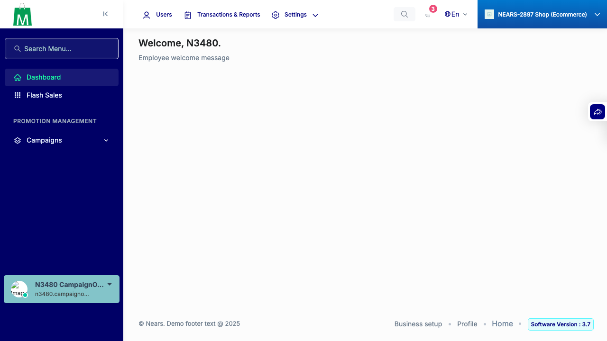
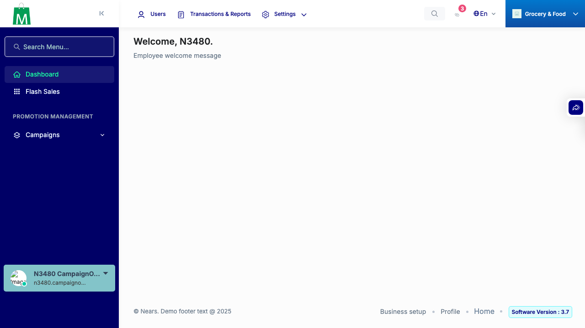
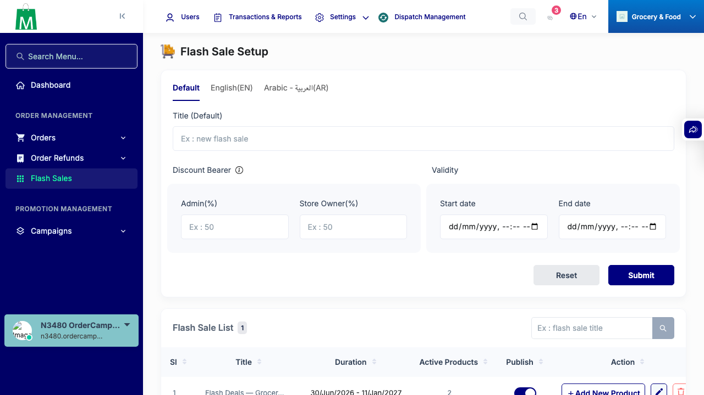
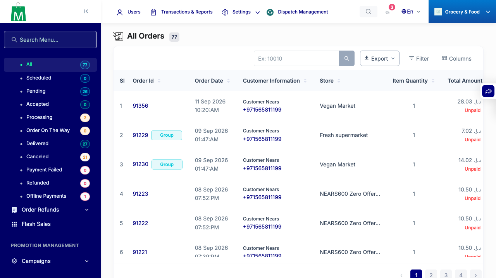

# QA Evidence — NEARS-3480

**[8b-confirm] CustomRole modules[] no-whitelist privesc — CONFIRMED (pre-existing, not in NEARS-3480 diff)**

**14 screenshot(s).** Click any thumbnail for full resolution.

<table>
<tr>
<td align="center" width="33%"> ac1 no tab 404</td>
<td align="center" width="33%"> ac2 edit role account prechecked</td>
<td align="center" width="33%"> ac2 negative no account denied</td>
</tr>
<tr>
<td align="center" width="33%"> ac2 positive account store disbursement</td>
<td align="center" width="33%"> ac3 bug campaign only no flash sales link</td>
<td align="center" width="33%"> ac3 fix campaign only flash sales visible ecommerce</td>
</tr>
<tr>
<td align="center" width="33%"> ac3 fix campaign only flash sales visible grocery</td>
<td align="center" width="33%"> ac3 negative no campaign no flash sales</td>
<td align="center" width="33%"> ac3 order plus campaign flash sales visible</td>
</tr>
<tr>
<td align="center" width="33%"> ac3 regression flash sales active state</td>
<td align="center" width="33%"> ac3 regression orders section intact</td>
<td align="center" width="33%"> ac4 order details after formrequest actions</td>
</tr>
<tr>
<td align="center" width="33%"> ac4 refund reason added</td>
<td align="center" width="33%"> ac5 bulk import page</td>
</tr>
</table>

### Other artifacts
- [`bug-custom-role-modules-no-whitelist-privesc.log`](bug-custom-role-modules-no-whitelist-privesc.log)

---
*From `nears/docs/qa-evidence/NEARS-3480/` · public-repo scrub policy (no live secrets; verified clean).*
