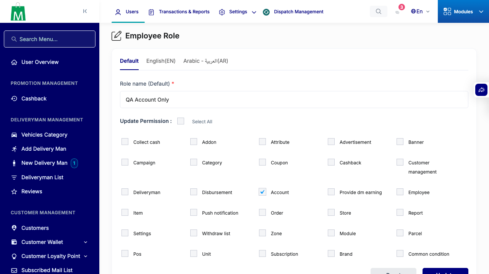
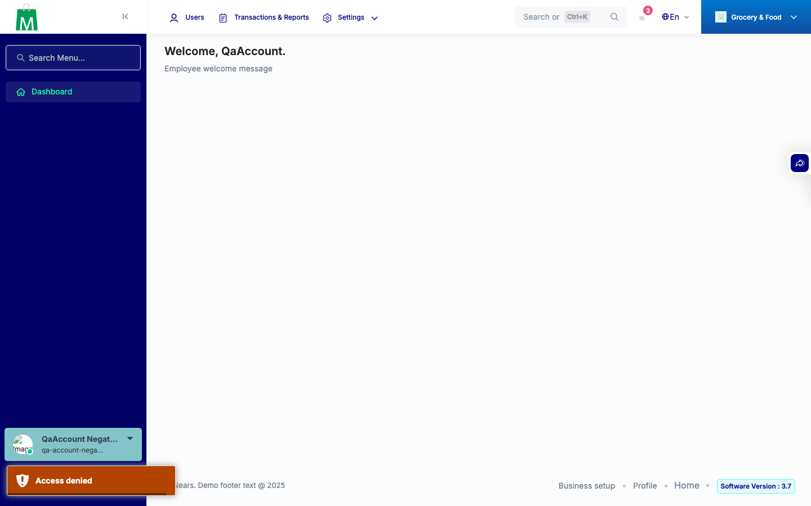
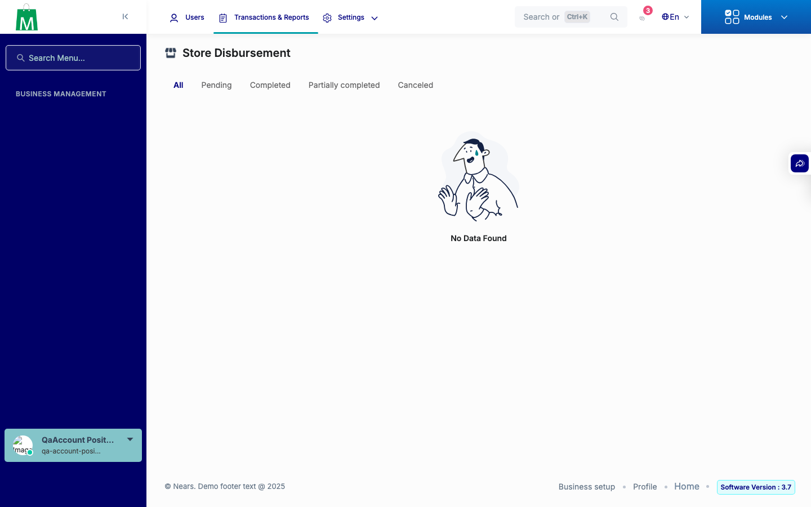
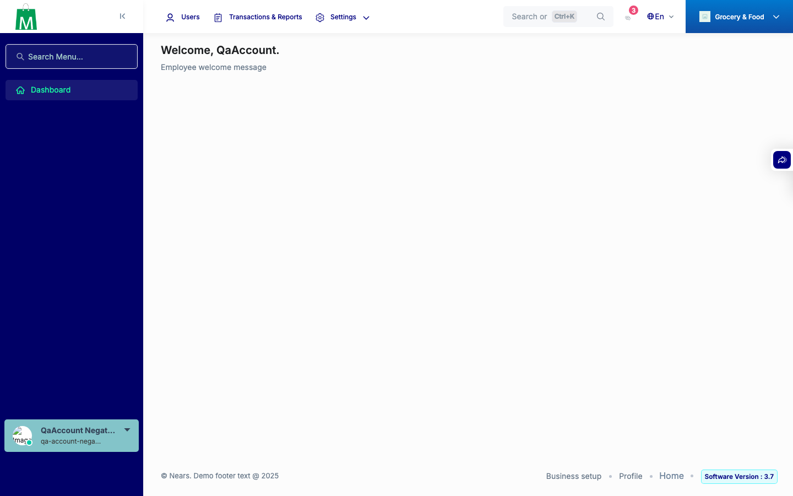
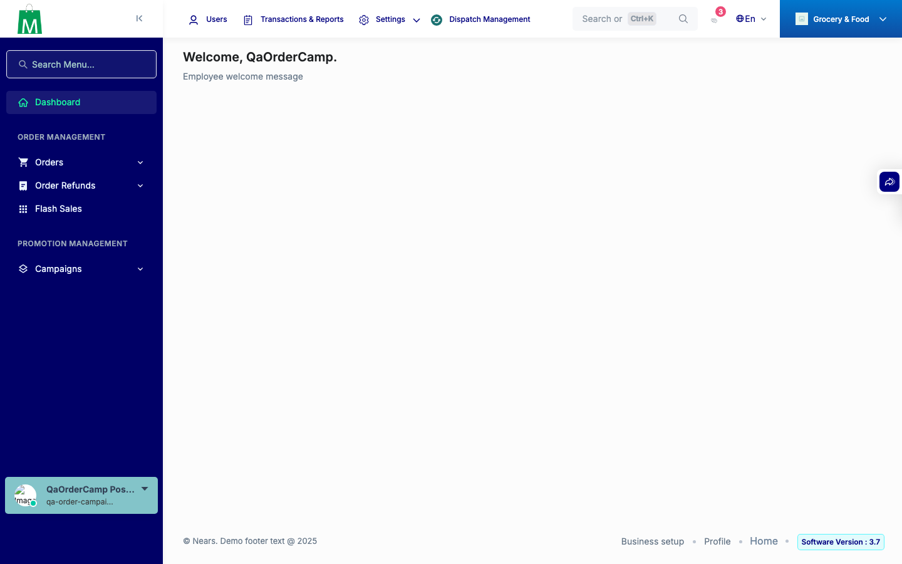
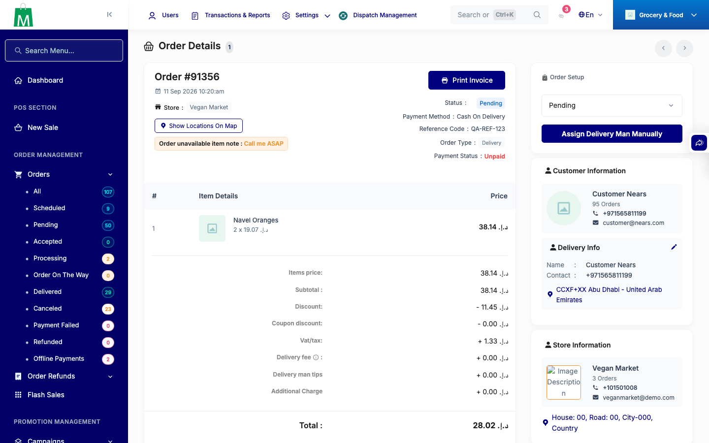
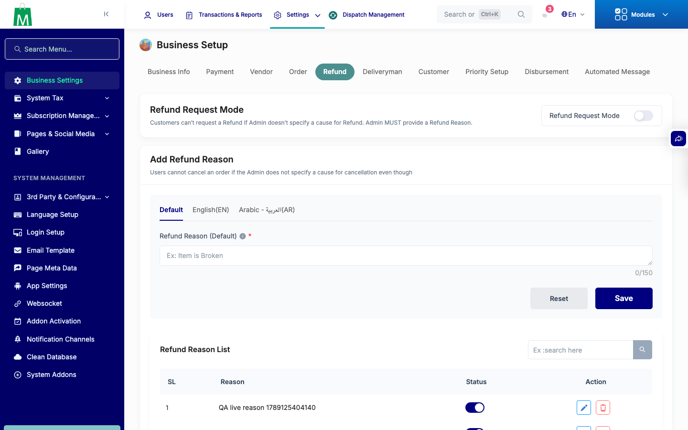
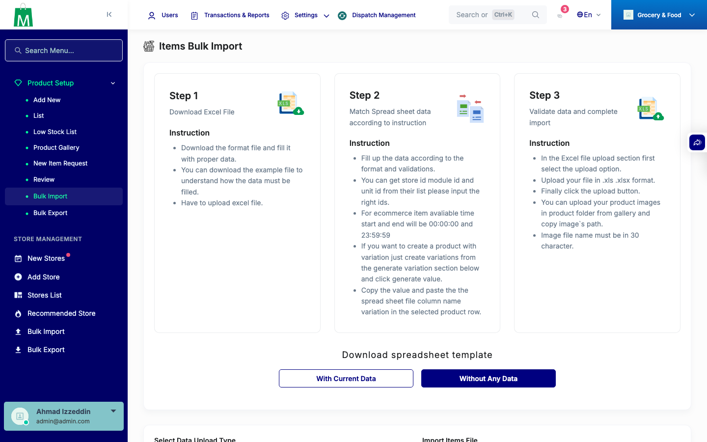

# QA Evidence — NEARS-3480

**FAIL — AC3 Flash Sales sidebar gate broken by pre-existing Orders-block nesting (campaign-only role never sees the link); AC1/AC2/AC4/AC5 PASS**

**10 screenshot(s).** Click any thumbnail for full resolution.

<table>
<tr>
<td align="center" width="33%"> ac1 no tab 404</td>
<td align="center" width="33%"> ac2 edit role account prechecked</td>
<td align="center" width="33%"> ac2 negative no account denied</td>
</tr>
<tr>
<td align="center" width="33%"> ac2 positive account store disbursement</td>
<td align="center" width="33%"> ac3 bug campaign only no flash sales link</td>
<td align="center" width="33%"> ac3 negative no campaign no flash sales</td>
</tr>
<tr>
<td align="center" width="33%"> ac3 order plus campaign flash sales visible</td>
<td align="center" width="33%"> ac4 order details after formrequest actions</td>
<td align="center" width="33%"> ac4 refund reason added</td>
</tr>
<tr>
<td align="center" width="33%"> ac5 bulk import page</td>
</tr>
</table>

---
*From `nears/docs/qa-evidence/NEARS-3480/` · public-repo scrub policy (no live secrets; verified clean).*
