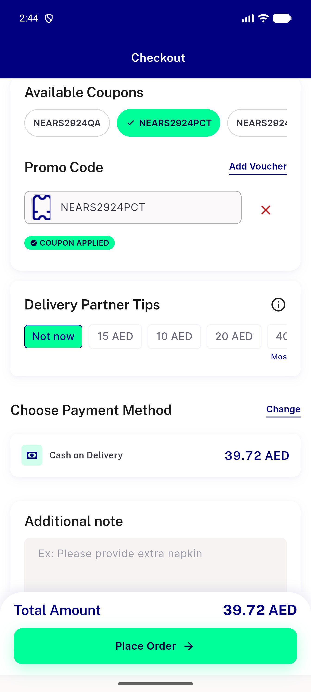

# QA Evidence — NEARS-3485

**PASS — AC1/AC2/AC3 all demonstrated live on emulator-5564, UserApp cold-start checkout tax dispatch fixed, coupon-clear a11y label verified LTR+RTL, no [ERR]/[FAIL] regressions**

**2 screenshot(s).** Click any thumbnail for full resolution.

<table>
<tr>
<td align="center" width="33%"> ac3 coupon clear applied</td>
<td align="center" width="33%"> regression rtl clear coupon ar</td>
</tr>
</table>

### Other artifacts
- [`ac3-a11y-dump-apply-state.xml`](ac3-a11y-dump-apply-state.xml)
- [`ac3-a11y-dump-rtl.xml`](ac3-a11y-dump-rtl.xml)
- [`ac3-a11y-dump.xml`](ac3-a11y-dump.xml)

---
*From `nears/docs/qa-evidence/NEARS-3485/` · public-repo scrub policy (no live secrets; verified clean).*
