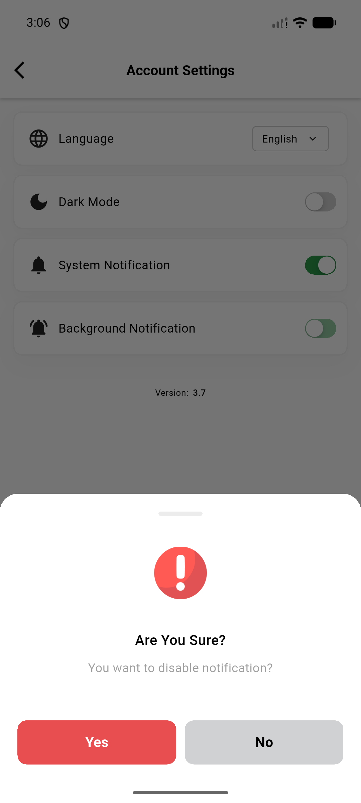
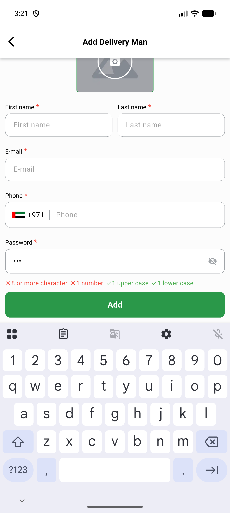

# QA Evidence — NEARS-3486

**PASS with environment-gated exceptions — VendorApp/DeliveryApp widget dedupe QA**

**2 screenshot(s).** Click any thumbnail for full resolution.

<table>
<tr>
<td align="center" width="33%"> ac1 notification toggle spinner</td>
<td align="center" width="33%"> ac1 password strength checklist</td>
</tr>
</table>

---
*From `nears/docs/qa-evidence/NEARS-3486/` · public-repo scrub policy (no live secrets; verified clean).*
