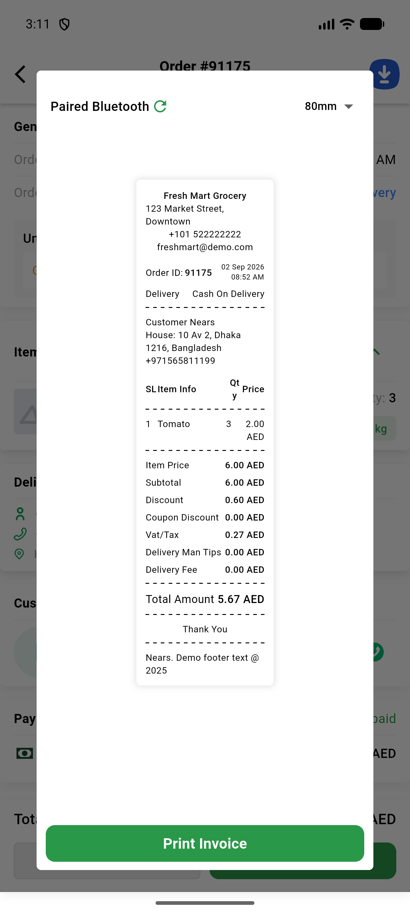
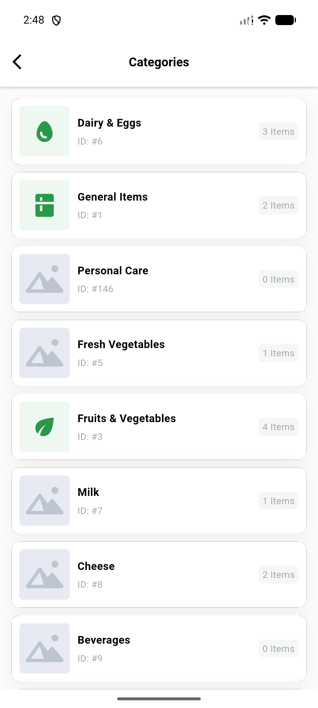
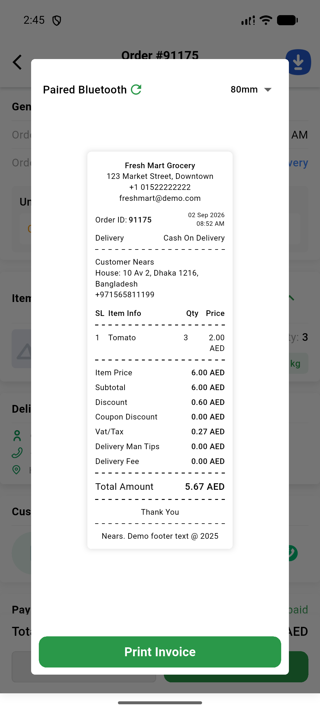

# QA Evidence — NEARS-3487

**QA re-check cycle 1 PASS — AC1 now renders +101 522222222 on the same fixture**

**4 screenshot(s).** Click any thumbnail for full resolution.

<table>
<tr>
<td align="center" width="33%"> ac1 invoice phone fixed cycle1</td>
<td align="center" width="33%"> ac2 category fresh render after switch</td>
<td align="center" width="33%"> ac3 release apk arm64 launch</td>
</tr>
<tr>
<td align="center" width="33%"> bug invoice phone wrong dialcode split</td>
</tr>
</table>

---
*From `nears/docs/qa-evidence/NEARS-3487/` · public-repo scrub policy (no live secrets; verified clean).*
