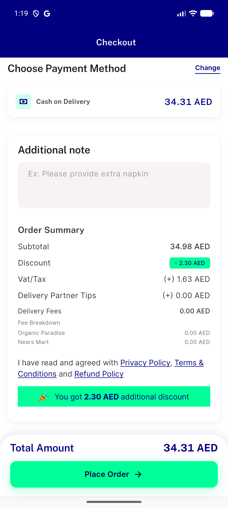
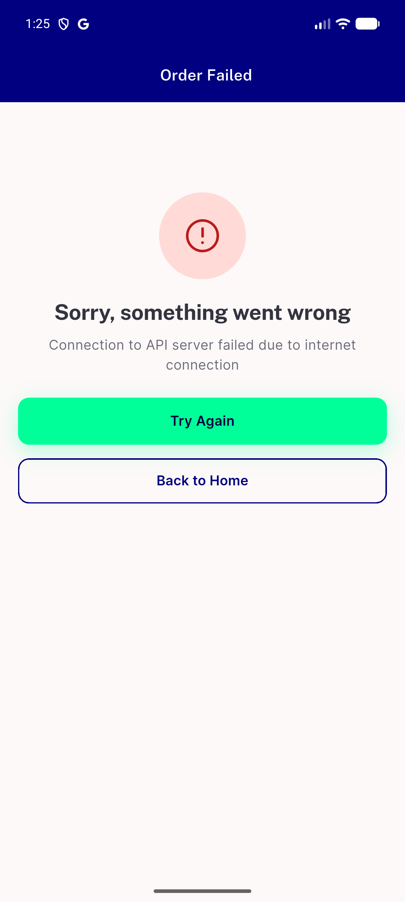

# QA Evidence — NEARS-3490

**PASS - checkout reliability hardening (AC1/AC2/AC3), live-verified on emulator-5554, regression-free**

**2 screenshot(s).** Click any thumbnail for full resolution.

<table>
<tr>
<td align="center" width="33%"> ac1 group fee breakdown</td>
<td align="center" width="33%"> ac3 network drop order failed</td>
</tr>
</table>

---
*From `nears/docs/qa-evidence/NEARS-3490/` · public-repo scrub policy (no live secrets; verified clean).*
