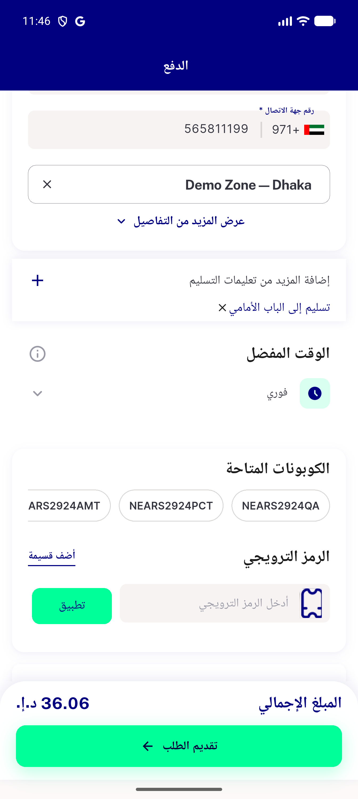
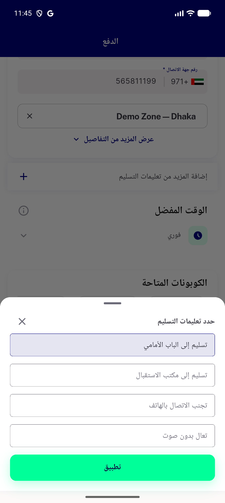

# QA Evidence — NEARS-3491

**PASS — AC1-AC4 verified live, UserApp, emulator-5554**

**2 screenshot(s).** Click any thumbnail for full resolution.

<table>
<tr>
<td align="center" width="33%"> ac3 checkout place order and instruction applied</td>
<td align="center" width="33%"> ac4 instruction selected and apply enabled</td>
</tr>
</table>

---
*From `nears/docs/qa-evidence/NEARS-3491/` · public-repo scrub policy (no live secrets; verified clean).*
