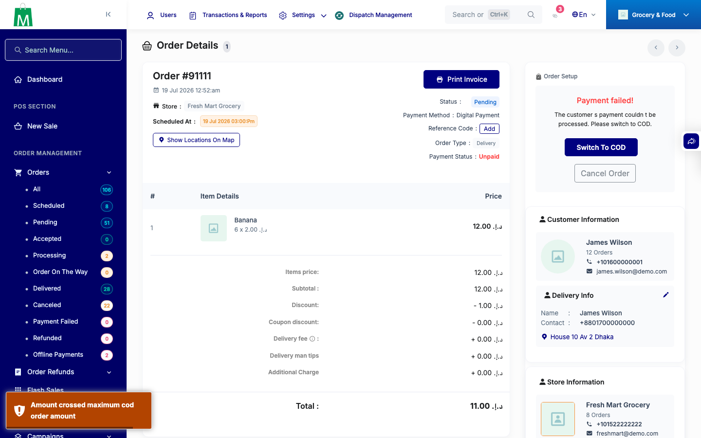
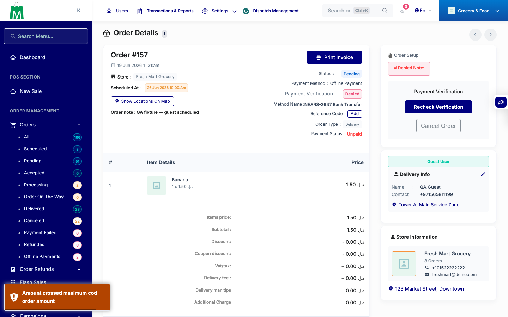
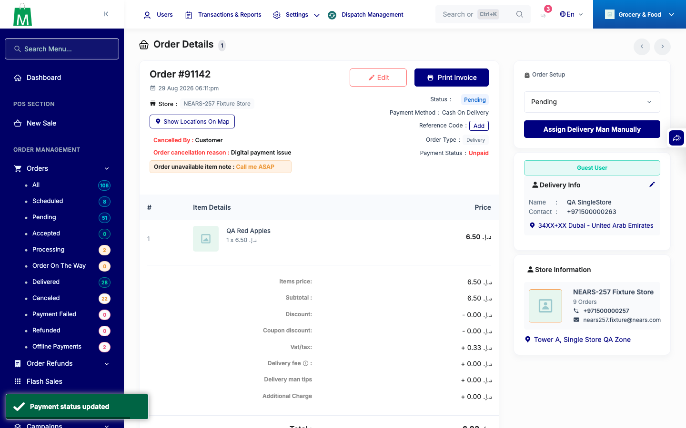
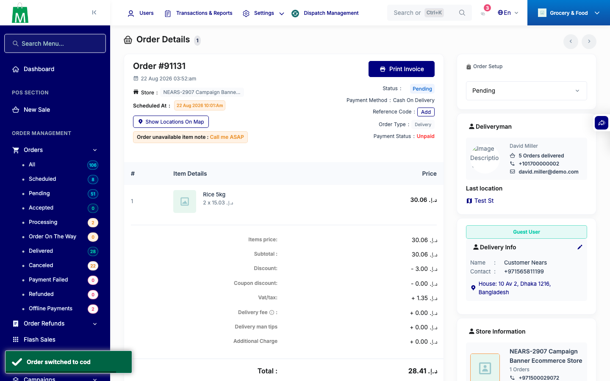
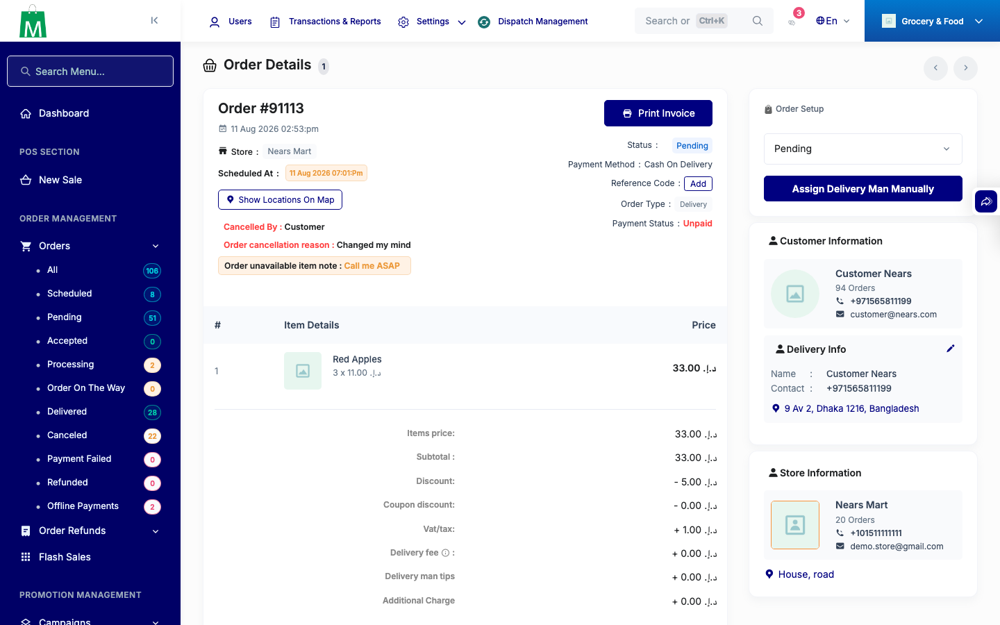

# QA Evidence — NEARS-3492

**PASS — admin COD-cap gate live-verified on both write paths**

**5 screenshot(s).** Click any thumbnail for full resolution.

<table>
<tr>
<td align="center" width="33%"> ac1 switch to cod overcap toast</td>
<td align="center" width="33%"> ac2 offline payment switched overcap toast</td>
<td align="center" width="33%"> ac4 offline payment switched zerocap toast</td>
</tr>
<tr>
<td align="center" width="33%"> ac4 switch to cod nullcap toast</td>
<td align="center" width="33%"> ac4 switch to cod undercap poststate</td>
</tr>
</table>

---
*From `nears/docs/qa-evidence/NEARS-3492/` · public-repo scrub policy (no live secrets; verified clean).*
