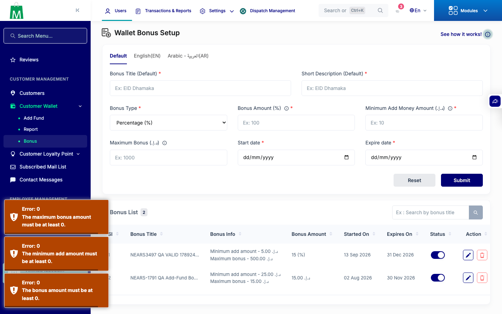
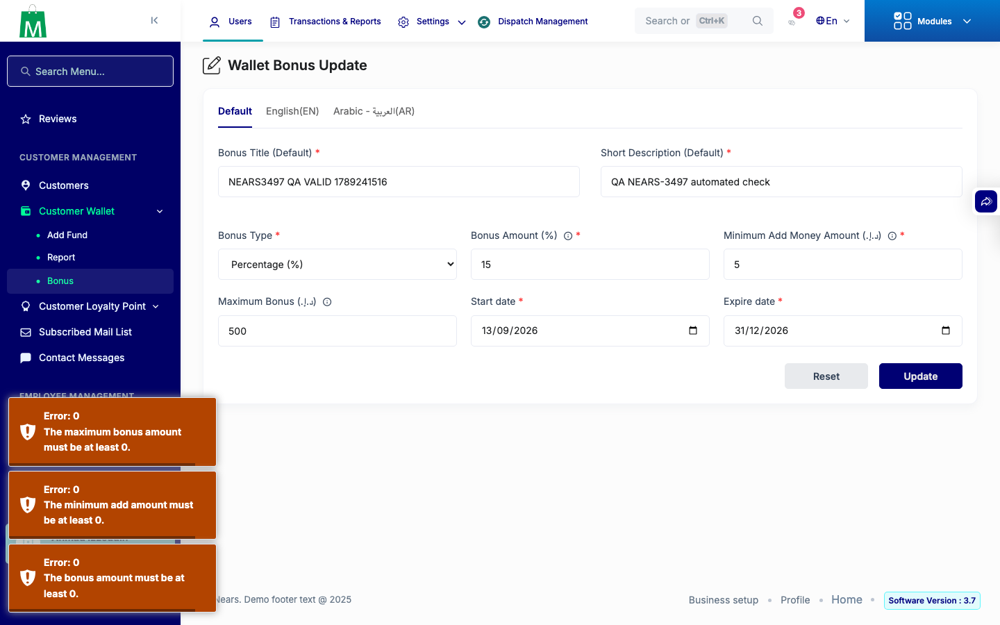

# QA Evidence — NEARS-3497

**PASS — WalletBonus numeric|min:0 server-side validation confirmed live on create + update forms; regression clean**

**2 screenshot(s).** Click any thumbnail for full resolution.

<table>
<tr>
<td align="center" width="33%"> ac3 create negative rejected</td>
<td align="center" width="33%"> ac4 update negative rejected</td>
</tr>
</table>

---
*From `nears/docs/qa-evidence/NEARS-3497/` · public-repo scrub policy (no live secrets; verified clean).*
