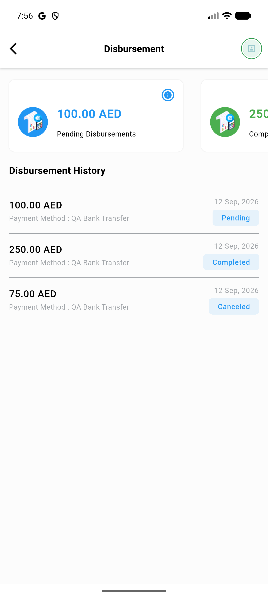
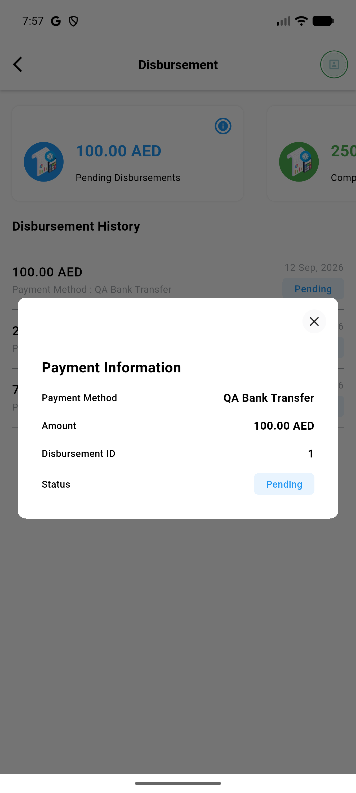
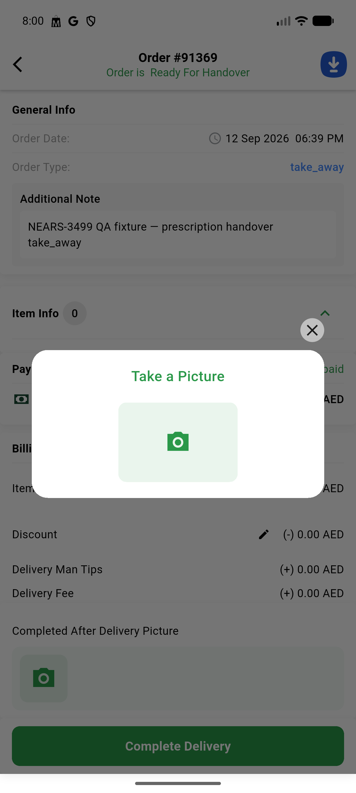
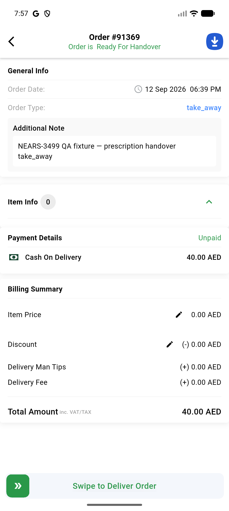
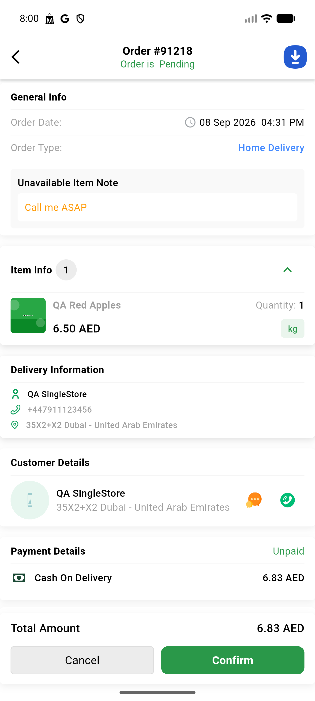

# QA Evidence — NEARS-3499

**PASS (delta re-QA, fix-cycle 1) — AC2/AC3/AC5 all PASS post-fix, regression check clean**

**5 screenshot(s).** Click any thumbnail for full resolution.

<table>
<tr>
<td align="center" width="33%"> ac2 delta disbursement history renders</td>
<td align="center" width="33%"> ac3 delta payment info dialog</td>
<td align="center" width="33%"> ac5 delta camera gallery picker</td>
</tr>
<tr>
<td align="center" width="33%"> ac5 delta order detail renders</td>
<td align="center" width="33%"> regression delta normal order 91218 renders</td>
</tr>
</table>

---
*From `nears/docs/qa-evidence/NEARS-3499/` · public-repo scrub policy (no live secrets; verified clean).*
