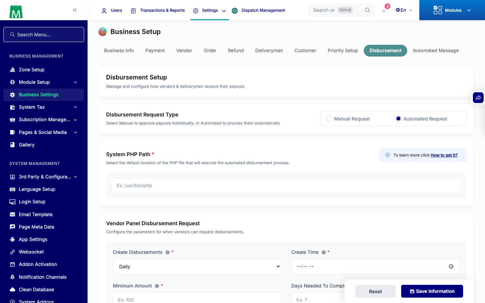
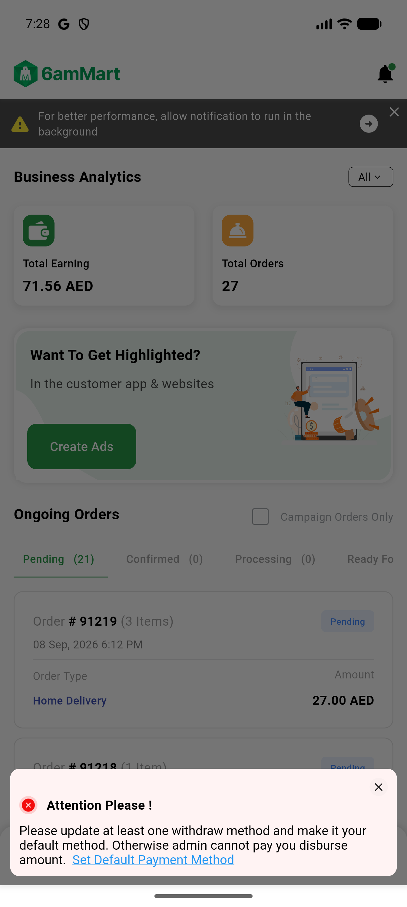
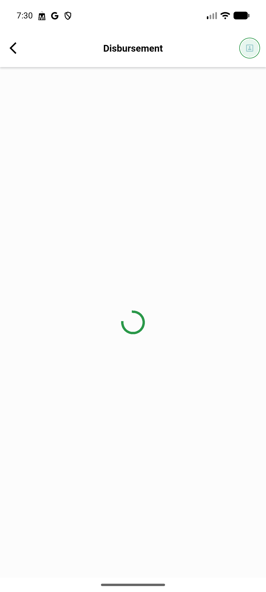
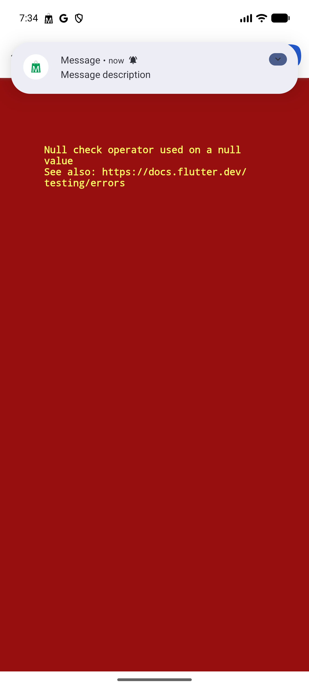

# QA Evidence — NEARS-3499

**FAIL — AC2/AC3/AC5 blocked by 2 pre-existing VendorApp crashes newly exposed by the fixture; AC1/AC4 PASS**

**4 screenshot(s).** Click any thumbnail for full resolution.

<table>
<tr>
<td align="center" width="33%"> ac1 admin disbursement automated</td>
<td align="center" width="33%"> ac4 withdraw method attention dialog</td>
<td align="center" width="33%"> bug disbursement history type crash</td>
</tr>
<tr>
<td align="center" width="33%"> bug order detail null check crash</td>
</tr>
</table>

### Other artifacts
- [`bug-disbursement-history-type-crash.log`](bug-disbursement-history-type-crash.log)
- [`bug-order-detail-null-check-crash.log`](bug-order-detail-null-check-crash.log)

---
*From `nears/docs/qa-evidence/NEARS-3499/` · public-repo scrub policy (no live secrets; verified clean).*
