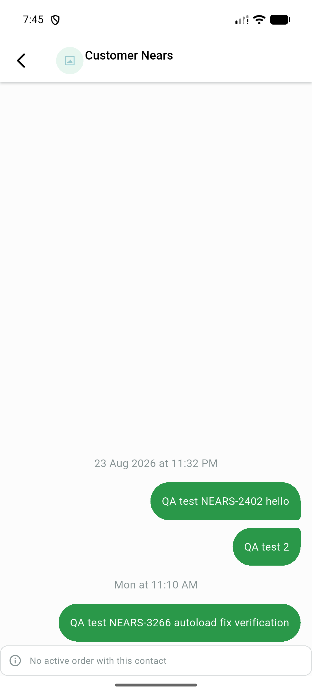
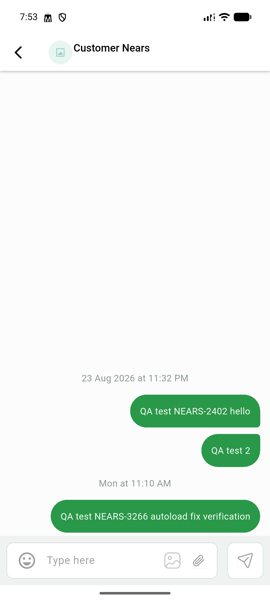
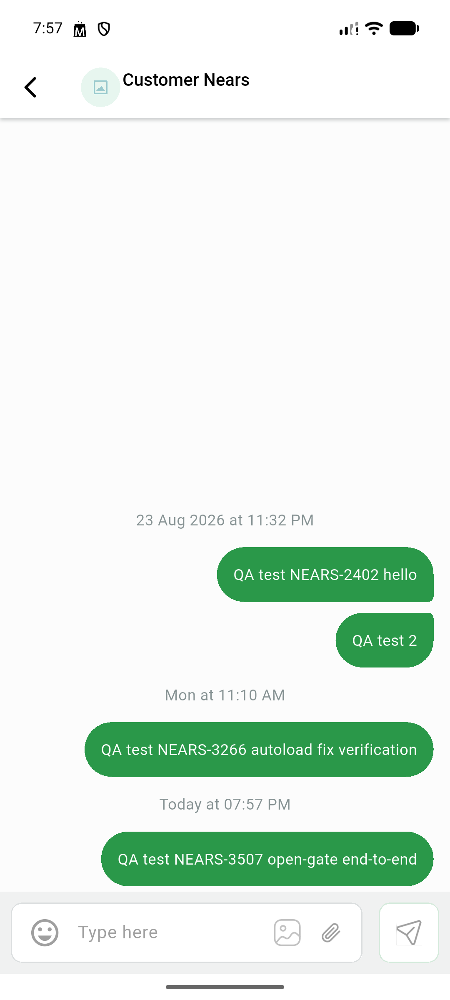
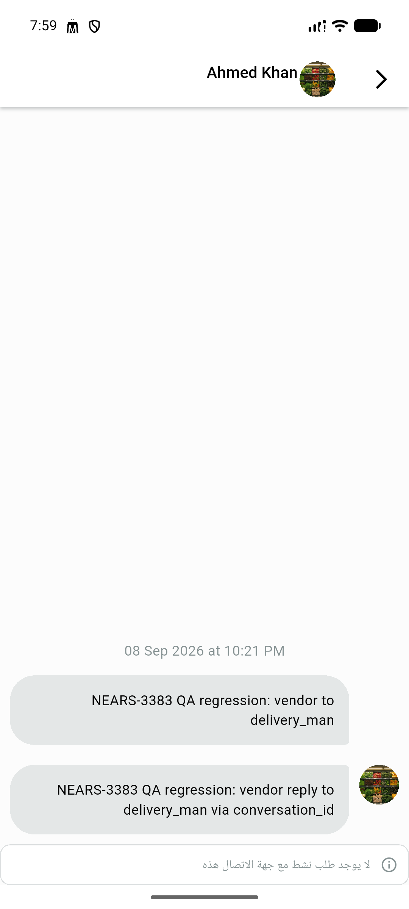

# QA Evidence — NEARS-3507

**PASS - closed-gate notice + open-gate composer + send e2e + RTL + AC4 fail-open (test-backed) live-QA'd on emulator-5558**

**4 screenshot(s).** Click any thumbnail for full resolution.

<table>
<tr>
<td align="center" width="33%"> ac1 closed gate notice</td>
<td align="center" width="33%"> ac2 open gate composer</td>
<td align="center" width="33%"> ac3 message sent</td>
</tr>
<tr>
<td align="center" width="33%"> ac5 rtl notice</td>
</tr>
</table>

### Other artifacts
- [`ac1-closed-gate-dump.xml`](ac1-closed-gate-dump.xml)
- [`ac2-open-gate-dump.xml`](ac2-open-gate-dump.xml)
- [`ac5-rtl-dump.xml`](ac5-rtl-dump.xml)
- [`bug-composer-icons-no-a11y-label-dump.xml`](bug-composer-icons-no-a11y-label-dump.xml)
- [`bug-order-details-call-chat-icons-no-a11y-label-dump.xml`](bug-order-details-call-chat-icons-no-a11y-label-dump.xml)

---
*From `nears/docs/qa-evidence/NEARS-3507/` · public-repo scrub policy (no live secrets; verified clean).*
