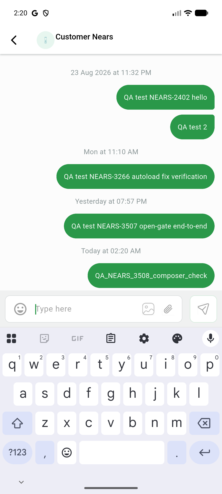

# QA Evidence — NEARS-3508

**PASS — 5/5 composer controls carry distinct non-generic a11y labels, TalkBack-order sensible, send-control gate states + loading state verified live, AC4 zero visual regression, RTL Arabic mirrors + labels correct, MenuAnchor regression clean**

**1 screenshot(s).** Click any thumbnail for full resolution.

<table>
<tr>
<td align="center" width="33%"> composer row after</td>
</tr>
</table>

### Other artifacts
- [`a11y-dump-composer-active.xml`](a11y-dump-composer-active.xml)
- [`a11y-dump-composer-arabic-rtl.xml`](a11y-dump-composer-arabic-rtl.xml)
- [`a11y-dump-composer-inactive.xml`](a11y-dump-composer-inactive.xml)
- [`a11y-dump-composer-loading.xml`](a11y-dump-composer-loading.xml)

---
*From `nears/docs/qa-evidence/NEARS-3508/` · public-repo scrub policy (no live secrets; verified clean).*
