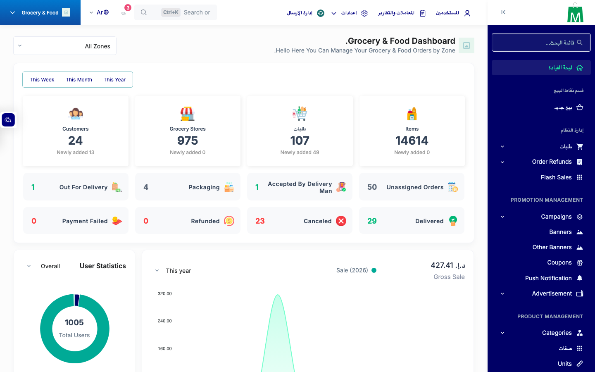

# QA Evidence — NEARS-3509

**PASS — admin/lang session-poisoning LFI chain fix verified live (AC1-AC4)**

**1 screenshot(s).** Click any thumbnail for full resolution.

<table>
<tr>
<td align="center" width="33%"> ac4 ar regression</td>
</tr>
</table>

---
*From `nears/docs/qa-evidence/NEARS-3509/` · public-repo scrub policy (no live secrets; verified clean).*
