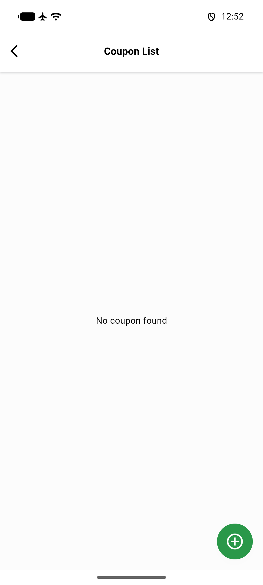

# QA Evidence — NEARS-3514

**PASS - 12/12 AC demonstrated live/phpunit; full Admin suite 2345 passed, only known NEARS-2019 red**

**1 screenshot(s).** Click any thumbnail for full resolution.

<table>
<tr>
<td align="center" width="33%"> ac6 vendorapp coupon list no crash</td>
</tr>
</table>

### Other artifacts
- [`ac1-captcha-fail-closed.log`](ac1-captcha-fail-closed.log)
- [`ac10-submit-review-guest-collision.log`](ac10-submit-review-guest-collision.log)
- [`ac11-message-module-gate.log`](ac11-message-module-gate.log)
- [`ac12-broadcast-channel-guard.log`](ac12-broadcast-channel-guard.log)
- [`ac2-currentmodule-trust-boundary.log`](ac2-currentmodule-trust-boundary.log)
- [`ac3-4-vendor-bulk-import-zone-scope.log`](ac3-4-vendor-bulk-import-zone-scope.log)
- [`ac5-guest-token-strict.log`](ac5-guest-token-strict.log)
- [`ac6-7-coupon-hardening.log`](ac6-7-coupon-hardening.log)
- [`ac8-otp-enumeration.log`](ac8-otp-enumeration.log)
- [`ac9-modulecheck-except-invalid.log`](ac9-modulecheck-except-invalid.log)

---
*From `nears/docs/qa-evidence/NEARS-3514/` · public-repo scrub policy (no live secrets; verified clean).*
