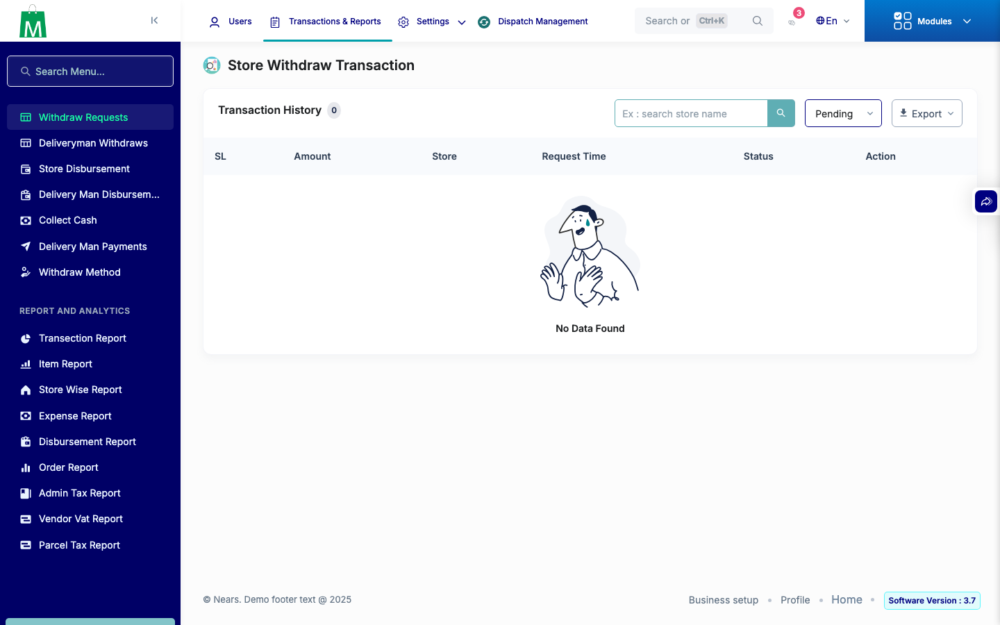
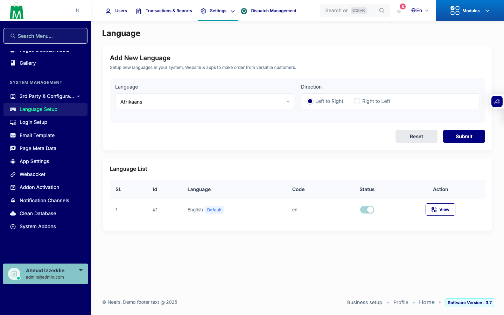
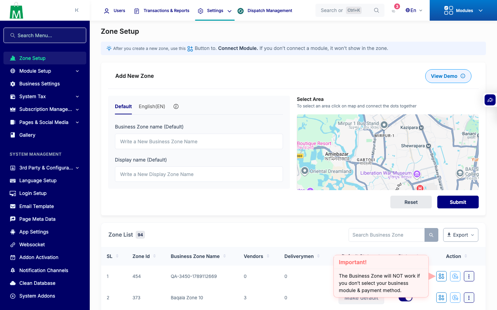

# QA Evidence — NEARS-3515

**QA NEARS-3515 TOCTOU/state-integrity bundle - PASS**

**3 screenshot(s).** Click any thumbnail for full resolution.

<table>
<tr>
<td align="center" width="33%"> ac5 vendor withdraw approved</td>
<td align="center" width="33%"> ac6 language after delete</td>
<td align="center" width="33%"> ac6 zone list</td>
</tr>
</table>

### Other artifacts
- [`ac1-ac2-payment-auth-rejected.log`](ac1-ac2-payment-auth-rejected.log)
- [`progress.md`](progress.md)

---
*From `nears/docs/qa-evidence/NEARS-3515/` · public-repo scrub policy (no live secrets; verified clean).*
