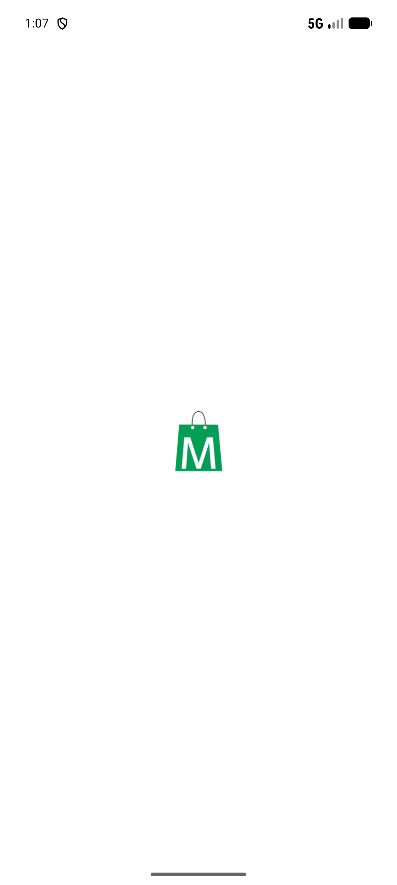
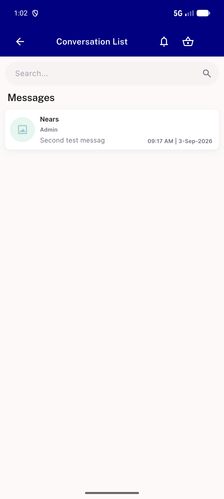

# QA Evidence — NEARS-3518

**PASS — 9-item UserApp security-findings bundle, 7/9 live-demonstrated (AC3 w/ positive control, AC5 end-to-end, AC7/AC8 confirmed live+static), AC1/AC6 UNVERIFIABLE-live (no MITM/iOS-signing rig) w/ strong static+test evidence, AC4 N/A stale finding**

**2 screenshot(s).** Click any thumbnail for full resolution.

<table>
<tr>
<td align="center" width="33%"> ac3 release check</td>
<td align="center" width="33%"> ac5 chat logout accountB clean</td>
</tr>
</table>

### Other artifacts
- [`ac3-release-gate-live.log`](ac3-release-gate-live.log)
- [`ac8-deeplink-live.log`](ac8-deeplink-live.log)
- [`bug-fcm-logout-401-race.log`](bug-fcm-logout-401-race.log)

---
*From `nears/docs/qa-evidence/NEARS-3518/` · public-repo scrub policy (no live secrets; verified clean).*
