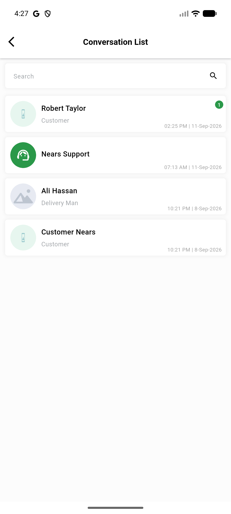
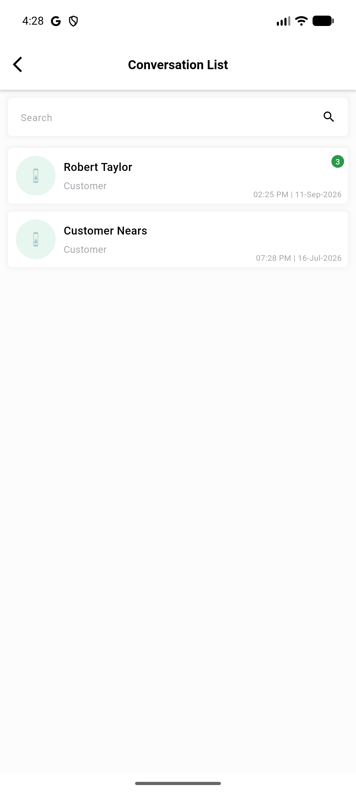
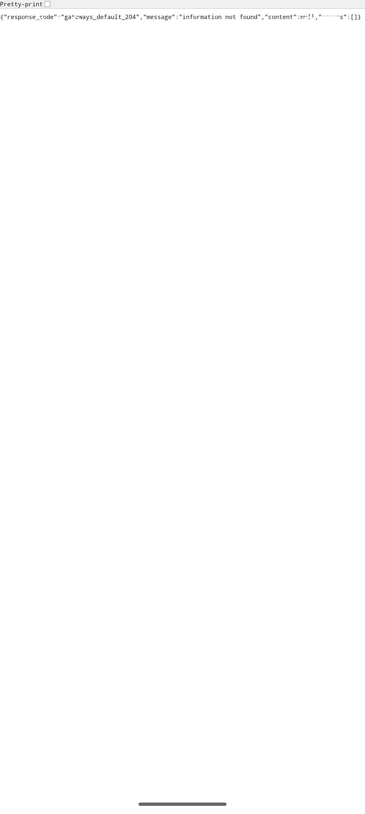
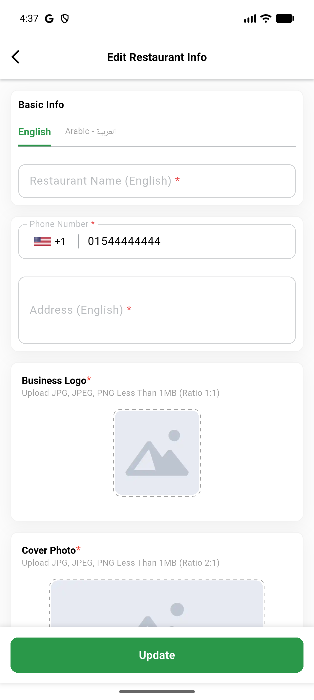
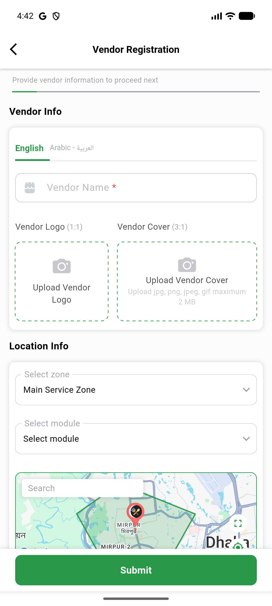
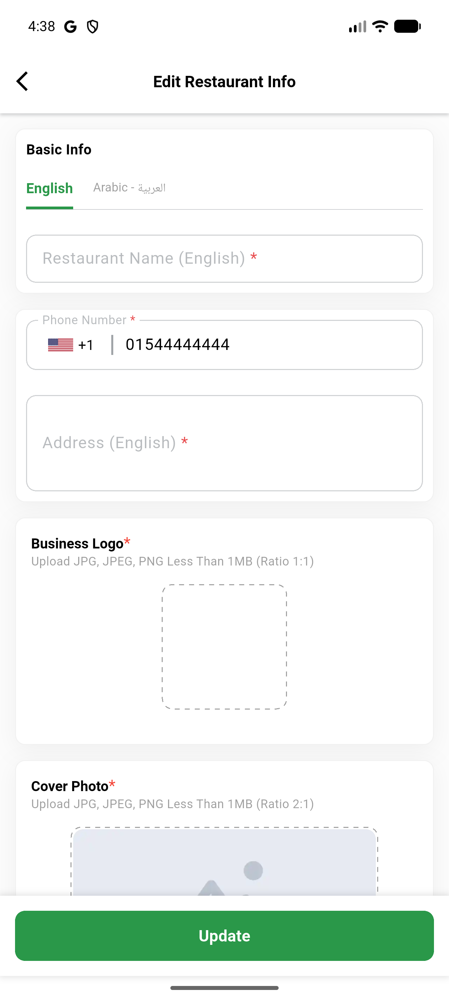

# QA Evidence — NEARS-3519

**PASS — VendorApp mobile-security-hardening bundle (9 ACs): AC1-AC9 demonstrated live on emulator-5556 (debug build) + code-path confirmation for AC2; automated backstop 24/24 pass**

**6 screenshot(s).** Click any thumbnail for full resolution.

<table>
<tr>
<td align="center" width="33%"> ac1 vendorA conversations</td>
<td align="center" width="33%"> ac1 vendorB conversations</td>
<td align="center" width="33%"> ac3 payment webview loaded</td>
</tr>
<tr>
<td align="center" width="33%"> ac6 store edit no json log</td>
<td align="center" width="33%"> ac8 maps renders registration</td>
<td align="center" width="33%"> ac9 image picker result</td>
</tr>
</table>

### Other artifacts
- [`ac2-webview-debug-gate-note.log`](ac2-webview-debug-gate-note.log)
- [`ac3-payment-allowlist-note.log`](ac3-payment-allowlist-note.log)
- [`ac4-secure-storage-evidence.log`](ac4-secure-storage-evidence.log)
- [`bug-payment-doubleback-navigator-assert.log`](bug-payment-doubleback-navigator-assert.log)

---
*From `nears/docs/qa-evidence/NEARS-3519/` · public-repo scrub policy (no live secrets; verified clean).*
