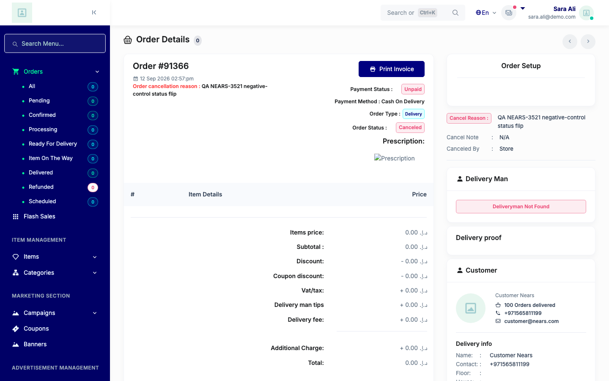
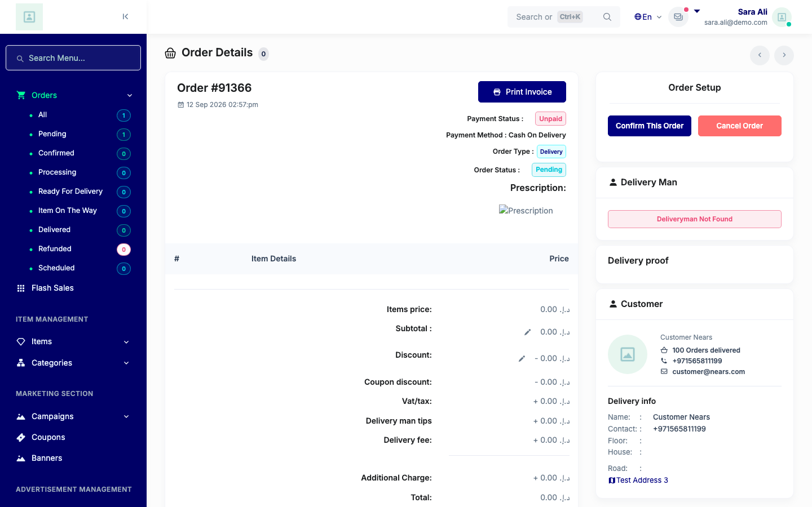

# QA Evidence — NEARS-3521

**QA PASS — NEARS-3521 dashboard UI hygiene: all 7 ACs demonstrated live**

**2 screenshot(s).** Click any thumbnail for full resolution.

<table>
<tr>
<td align="center" width="33%"> ac5 negative status 91366</td>
<td align="center" width="33%"> ac5 positive 91366</td>
</tr>
</table>

### Other artifacts
- [`ac1-console-clean.log`](ac1-console-clean.log)
- [`ac2-triage-doc-check.log`](ac2-triage-doc-check.log)
- [`ac3-pos-order-ids.log`](ac3-pos-order-ids.log)
- [`ac4-dead-routes-404.log`](ac4-dead-routes-404.log)
- [`ac5-order-view-gate.log`](ac5-order-view-gate.log)
- [`ac6-minimum-order-message.log`](ac6-minimum-order-message.log)
- [`ac7-pos-generic-catch-json.log`](ac7-pos-generic-catch-json.log)

---
*From `nears/docs/qa-evidence/NEARS-3521/` · public-repo scrub policy (no live secrets; verified clean).*
