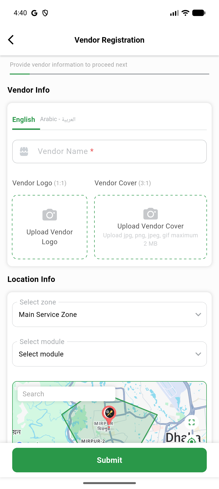
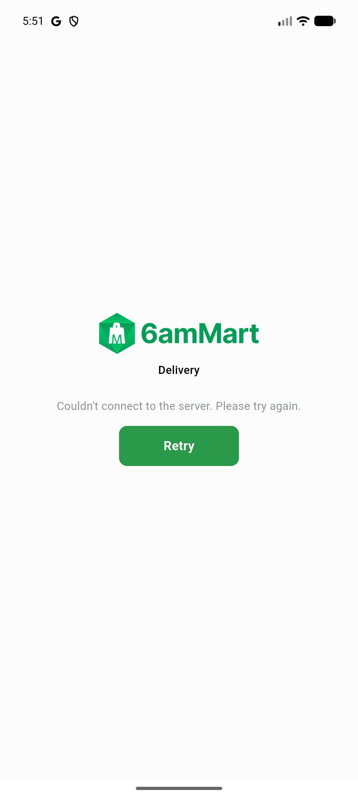
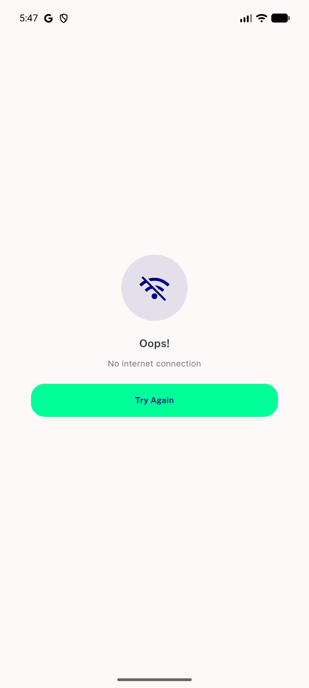
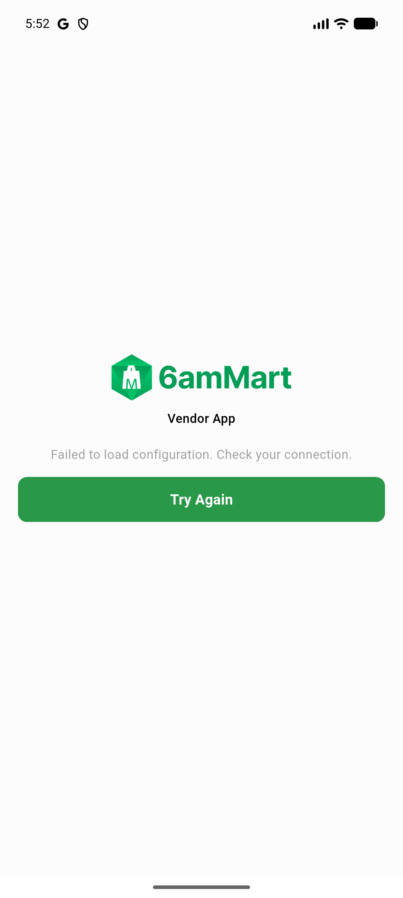

# QA Evidence — NEARS-3522

**PASS - fix-cycle 1 delta re-QA: AC4 release-splash-hang fix confirmed live on UserApp/DeliveryApp/VendorApp**

**7 screenshot(s).** Click any thumbnail for full resolution.

<table>
<tr>
<td align="center" width="33%"> ac2 profile email updated</td>
<td align="center" width="33%"> ac3 vendorapp maps render</td>
<td align="center" width="33%"> ac4 deliveryapp release launched</td>
</tr>
<tr>
<td align="center" width="33%"> ac4 userapp release build launched</td>
<td align="center" width="33%"> ac4 userapp release launched</td>
<td align="center" width="33%"> ac4 userapp release stuck check</td>
</tr>
<tr>
<td align="center" width="33%"> ac4 vendorapp release launched</td>
</tr>
</table>

### Other artifacts
- [`bug-ac4-release-build-stuck-splash.log`](bug-ac4-release-build-stuck-splash.log)
- [`bug-deliveryapp-silent-failure-path.log`](bug-deliveryapp-silent-failure-path.log)
- [`bug-useraapp-maps-key-empty.log`](bug-useraapp-maps-key-empty.log)
- [`bug-vendorapp-hero-duplicate-tag.log`](bug-vendorapp-hero-duplicate-tag.log)
- [`progress.md`](progress.md)

---
*From `nears/docs/qa-evidence/NEARS-3522/` · public-repo scrub policy (no live secrets; verified clean).*
