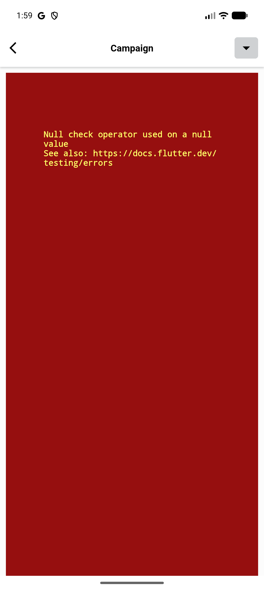
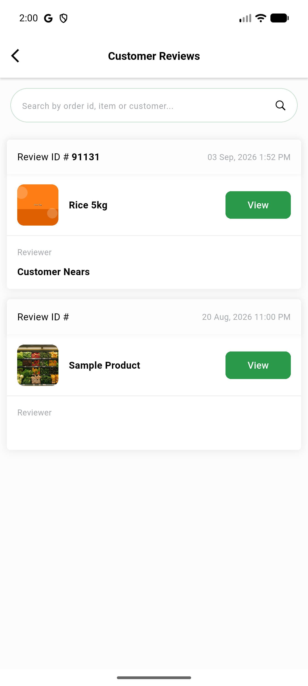
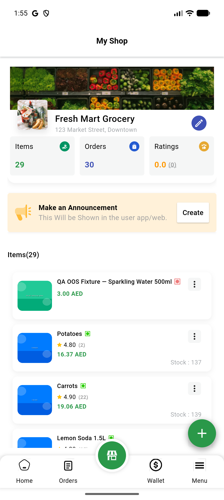

# QA Evidence — NEARS-3525

**PASS - VendorApp CustomImageWidget placeholder field removal verified live on 2/3 call sites (Store screen, Review card widget); Campaign details screen verified via static diff only (live nav blocked by unrelated pre-existing bug in campaign_widget.dart)**

**3 screenshot(s).** Click any thumbnail for full resolution.

<table>
<tr>
<td align="center" width="33%"> bug campaign list nullcheck crash</td>
<td align="center" width="33%"> review card screen</td>
<td align="center" width="33%"> store screen</td>
</tr>
</table>

### Other artifacts
- [`bug-campaign-list-nullcheck-crash.log`](bug-campaign-list-nullcheck-crash.log)
- [`progress.md`](progress.md)

---
*From `nears/docs/qa-evidence/NEARS-3525/` · public-repo scrub policy (no live secrets; verified clean).*
