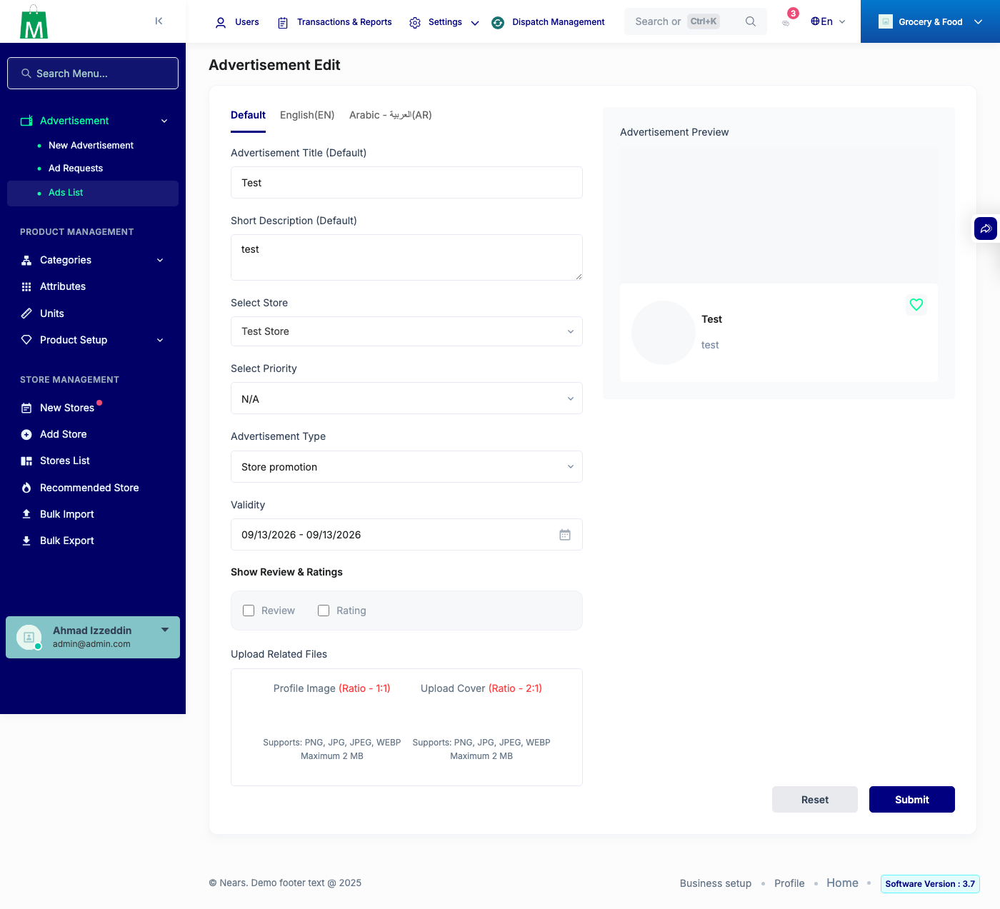
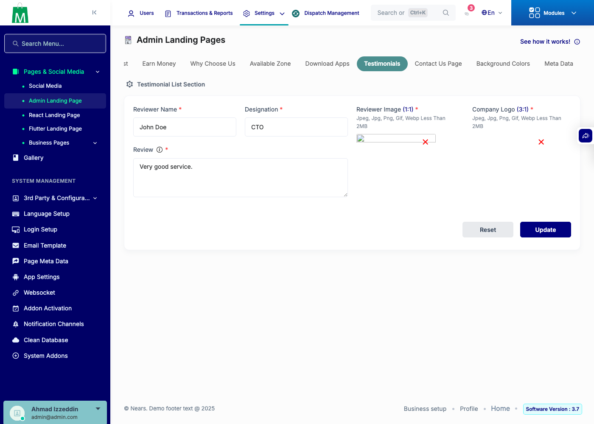

# QA Evidence — NEARS-3530

**PASS - backend-only trait conversion, 7/7 ACs live-verified**

**2 screenshot(s).** Click any thumbnail for full resolution.

<table>
<tr>
<td align="center" width="33%"> ac3 advertisement edit</td>
<td align="center" width="33%"> ac4 admintestimonial edit</td>
</tr>
</table>

### Other artifacts
- [`ac2-scope-greps.log`](ac2-scope-greps.log)
- [`ac5-zone-diff.log`](ac5-zone-diff.log)
- [`ac6-api-diff.log`](ac6-api-diff.log)
- [`bug-none-ac1-mutation-check.log`](bug-none-ac1-mutation-check.log)

---
*From `nears/docs/qa-evidence/NEARS-3530/` · public-repo scrub policy (no live secrets; verified clean).*
