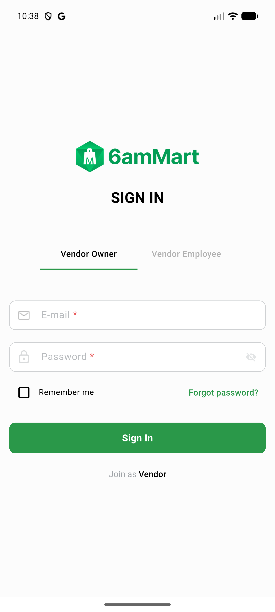
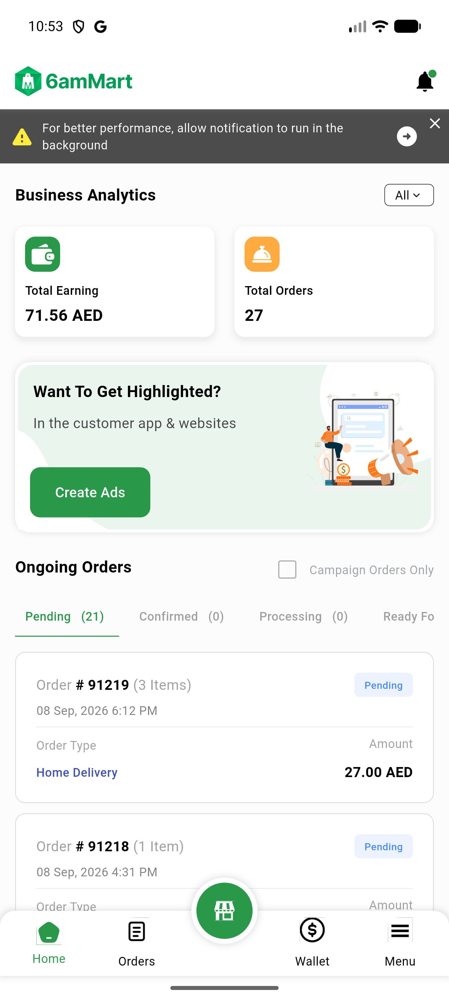

# QA Evidence — NEARS-3534

**PASS - VendorApp boots with google-services.json ABSENT (Firebase init unsuccessful, no core/no-app crash); analytics observer + events unchanged when PRESENT**

**2 screenshot(s).** Click any thumbnail for full resolution.

<table>
<tr>
<td align="center" width="33%"> ac1 signin no google services</td>
<td align="center" width="33%"> ac2 dashboard with google services</td>
</tr>
</table>

### Other artifacts
- [`ac1-boot-no-google-services.log`](ac1-boot-no-google-services.log)
- [`ac2-analytics-events.log`](ac2-analytics-events.log)

---
*From `nears/docs/qa-evidence/NEARS-3534/` · public-repo scrub policy (no live secrets; verified clean).*
