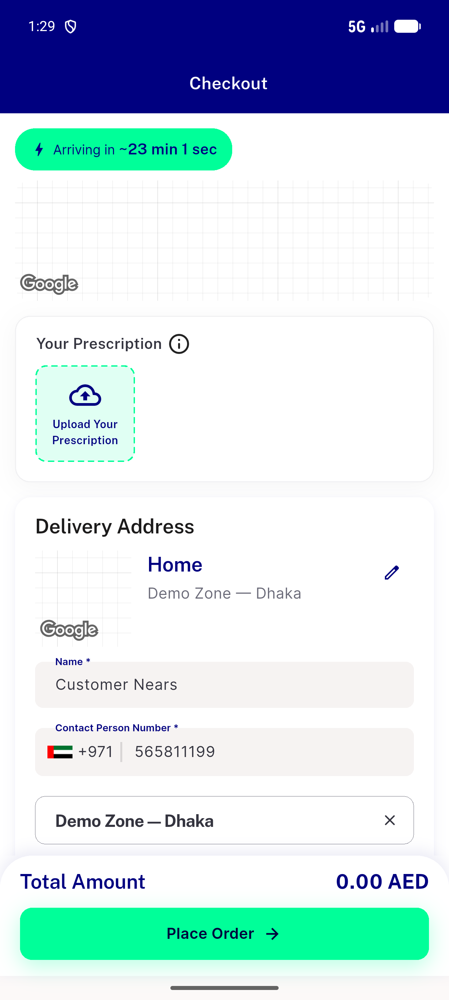

# QA Evidence — NEARS-3538

**PASS (delta re-QA, cycle 1) — fix confirmed: FAB now renders as compact 135x135px icon button, not full-height strip; tap-through to prescription checkout re-confirmed**

**4 screenshot(s).** Click any thumbnail for full resolution.

<table>
<tr>
<td align="center" width="33%"> ac2 after fix compact pill</td>
<td align="center" width="33%"> ac2 fab current state full</td>
<td align="center" width="33%"> ac3 refix tap navigates to checkout</td>
</tr>
<tr>
<td align="center" width="33%"> ac3 tap navigates to prescription checkout</td>
</tr>
</table>

### Other artifacts
- [`ac1-fab-vertical-strip-dump.xml`](ac1-fab-vertical-strip-dump.xml)
- [`ac2-after-fix-compact-pill-dump.xml`](ac2-after-fix-compact-pill-dump.xml)
- [`progress.md`](progress.md)

---
*From `nears/docs/qa-evidence/NEARS-3538/` · public-repo scrub policy (no live secrets; verified clean).*
