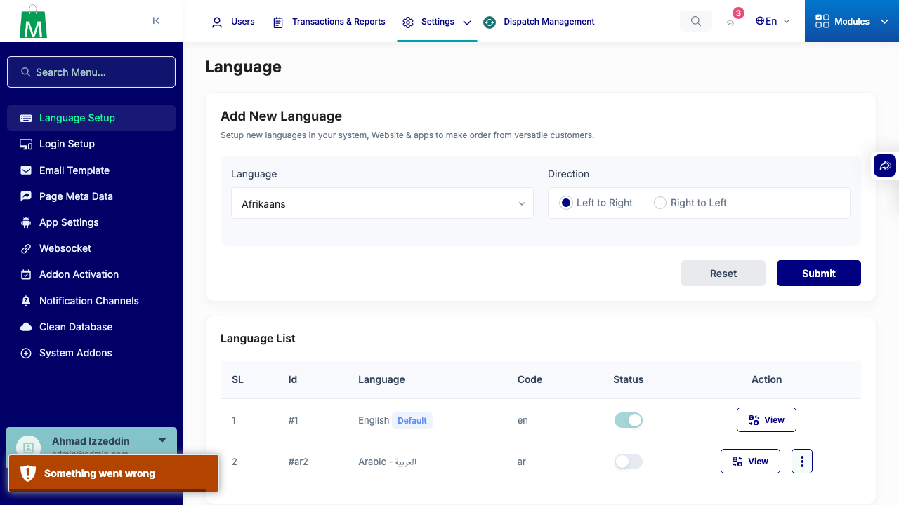

# QA Evidence — NEARS-3539

**PASS - AC1 (a) automated race-lock backstop 4/4, AC2 (b) live negative-case demo + 6/6 dedicated tests**

**1 screenshot(s).** Click any thumbnail for full resolution.

<table>
<tr>
<td align="center" width="33%"> ac2 negative case toast</td>
</tr>
</table>

### Other artifacts
- [`ac1-automated-tests.log`](ac1-automated-tests.log)
- [`ac2-negative-case.log`](ac2-negative-case.log)

---
*From `nears/docs/qa-evidence/NEARS-3539/` · public-repo scrub policy (no live secrets; verified clean).*
