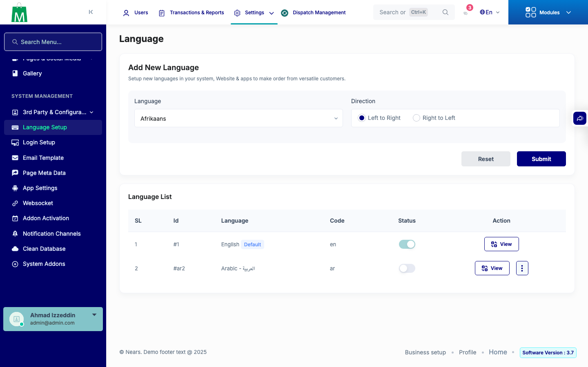

# QA Evidence — NEARS-3539

**PASS delta (AC3 + fix-in-run) — sys_language status filter live-confirmed**

**1 screenshot(s).** Click any thumbnail for full resolution.

<table>
<tr>
<td align="center" width="33%"> ac3 admin language toggle</td>
</tr>
</table>

---
*From `nears/docs/qa-evidence/NEARS-3539/` · public-repo scrub policy (no live secrets; verified clean).*
