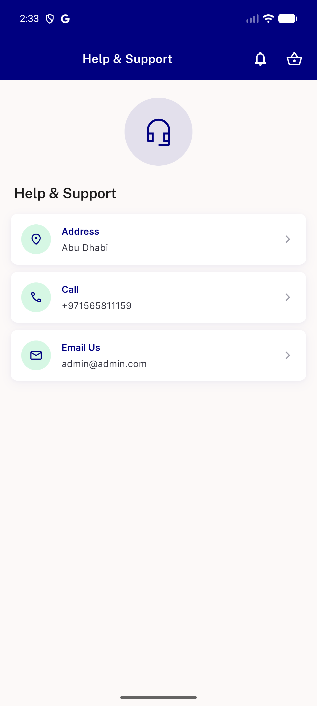
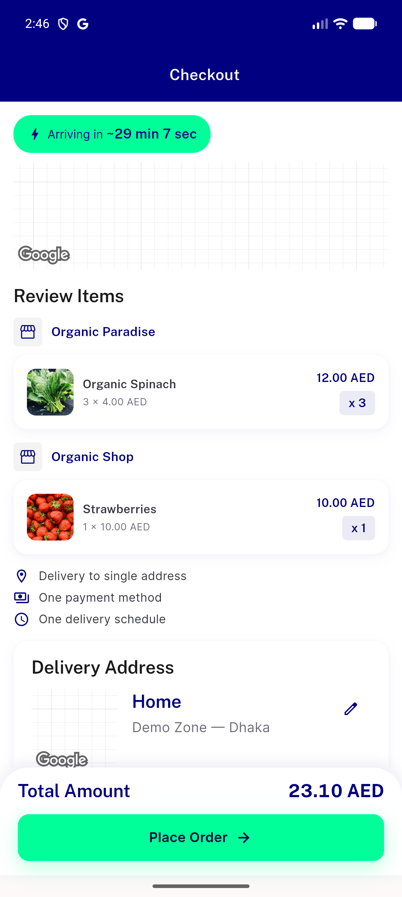

# QA Evidence — NEARS-3540

**PASS - AC1 support screen render clean, AC2 epoch-guard race fix verified live**

**2 screenshot(s).** Click any thumbnail for full resolution.

<table>
<tr>
<td align="center" width="33%"> ac1 support screen</td>
<td align="center" width="33%"> ac2 checkout mixed store cart</td>
</tr>
</table>

### Other artifacts
- [`bug-scrollcontroller-disposed-race.log`](bug-scrollcontroller-disposed-race.log)

---
*From `nears/docs/qa-evidence/NEARS-3540/` · public-repo scrub policy (no live secrets; verified clean).*
