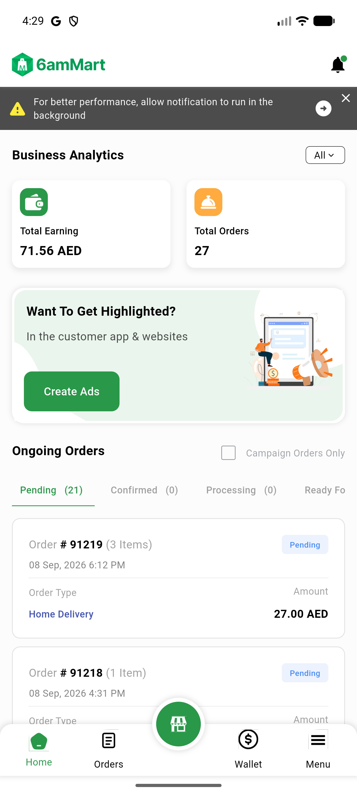
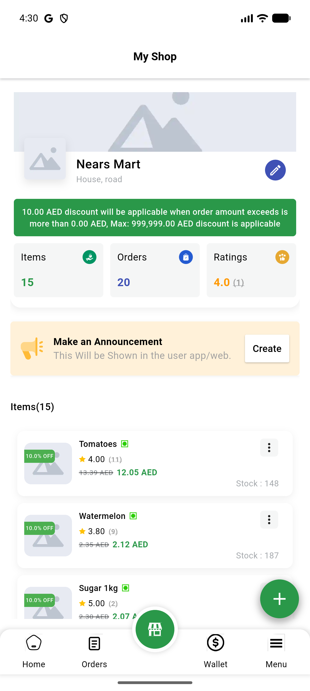

# QA Evidence — NEARS-3541

**Re-QA cycle 3/round 2: AC2 PASS (hero-collision fix confirmed clean, both starting tabs), AC1 unaffected regression PASS**

**2 screenshot(s).** Click any thumbnail for full resolution.

<table>
<tr>
<td align="center" width="33%"> ac2 recycle2 home tab after update clean</td>
<td align="center" width="33%"> ac2 recycle2 store tab after update clean</td>
</tr>
</table>

### Other artifacts
- [`ac2-recycle2-logcat-clean-excerpt.log`](ac2-recycle2-logcat-clean-excerpt.log)

---
*From `nears/docs/qa-evidence/NEARS-3541/` · public-repo scrub policy (no live secrets; verified clean).*
