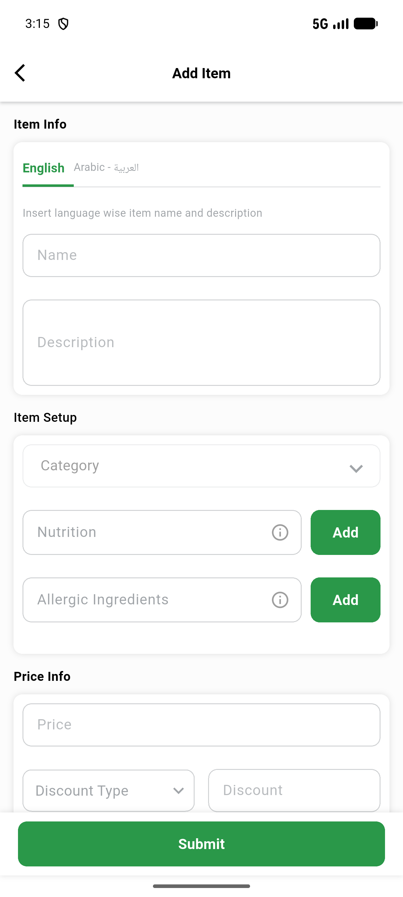
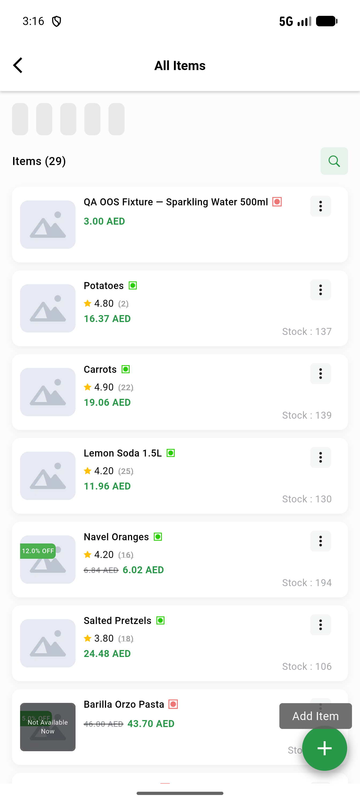
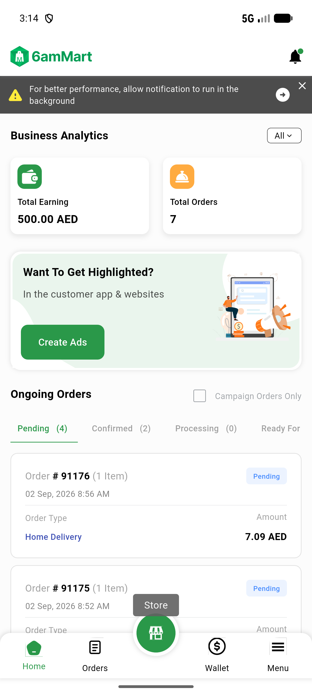
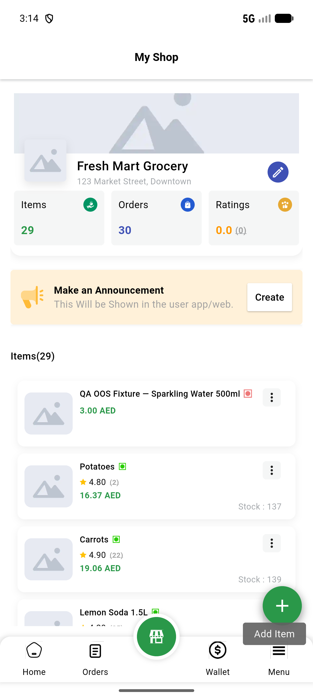
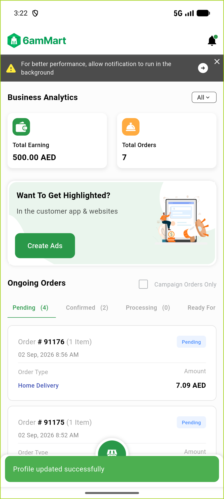
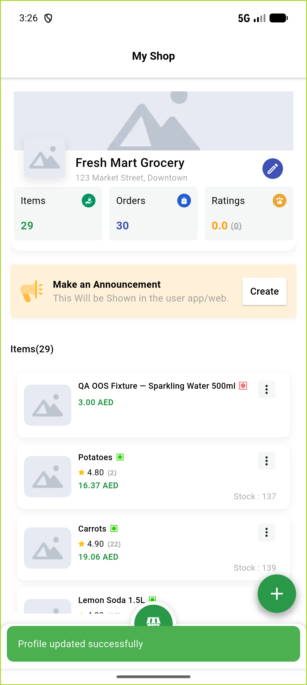

# QA Evidence — NEARS-3541

**FAIL - AC1 PASS (3/4 tooltips demonstrated live, 4th confirmed not-reachable via feature flag), AC2 FAIL (Hero-tag collision reproduced live, filed as task_bug)**

**6 screenshot(s).** Click any thumbnail for full resolution.

<table>
<tr>
<td align="center" width="33%"> ac1 add item screen ai fab not reachable</td>
<td align="center" width="33%"> ac1 allitems additem fab tooltip</td>
<td align="center" width="33%"> ac1 dashboard store fab tooltip</td>
</tr>
<tr>
<td align="center" width="33%"> ac1 storescreen additem fab tooltip</td>
<td align="center" width="33%"> ac2 repro1 home tab after save</td>
<td align="center" width="33%"> ac2 repro2 store tab after save</td>
</tr>
</table>

### Other artifacts
- [`ac1-add-item-screen-ai-fab-absent-dump.xml`](ac1-add-item-screen-ai-fab-absent-dump.xml)
- [`bug-ac2-hero-collision-default-fab-tag.log`](bug-ac2-hero-collision-default-fab-tag.log)
- [`progress.md`](progress.md)

---
*From `nears/docs/qa-evidence/NEARS-3541/` · public-repo scrub policy (no live secrets; verified clean).*
