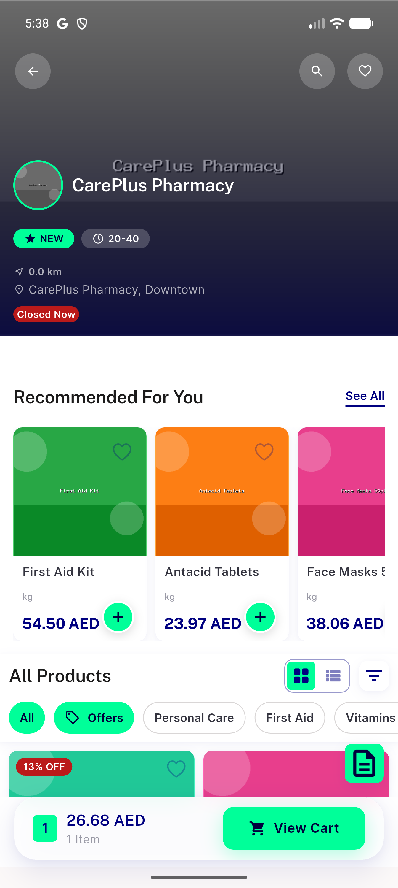

# QA Evidence — NEARS-3545

**PASS — NIconButton(shape:square) swap verified live on emulator-5554 (CarePlus Pharmacy, store id 42); AC1/AC2/AC3 demonstrated; RTL mirror + negative-control confirmed**

**2 screenshot(s).** Click any thumbnail for full resolution.

<table>
<tr>
<td align="center" width="33%"> ac1 after niconbutton</td>
<td align="center" width="33%"> ac1 before legacy composition</td>
</tr>
</table>

---
*From `nears/docs/qa-evidence/NEARS-3545/` · public-repo scrub policy (no live secrets; verified clean).*
