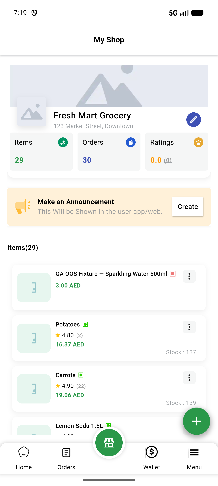

# QA Evidence — NEARS-3553

**PASS — AC1 heroTag fix confirmed live (no hero collision), AC2 flutter analyze 172->171 confirmed + boot timing normal, AC3 investigation-only confirmed no code changes + order flow regression clean**

**1 screenshot(s).** Click any thumbnail for full resolution.

<table>
<tr>
<td align="center" width="33%"> ac1 store screen post roundtrip</td>
</tr>
</table>

---
*From `nears/docs/qa-evidence/NEARS-3553/` · public-repo scrub policy (no live secrets; verified clean).*
