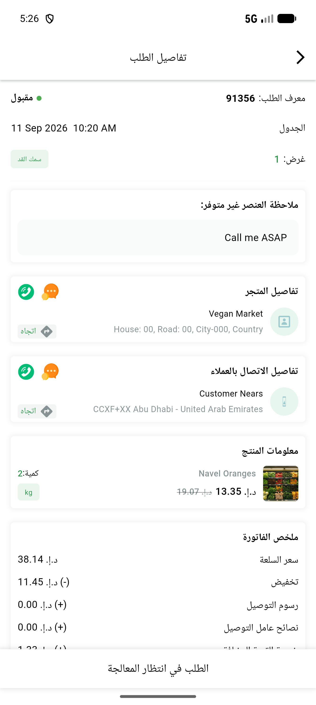
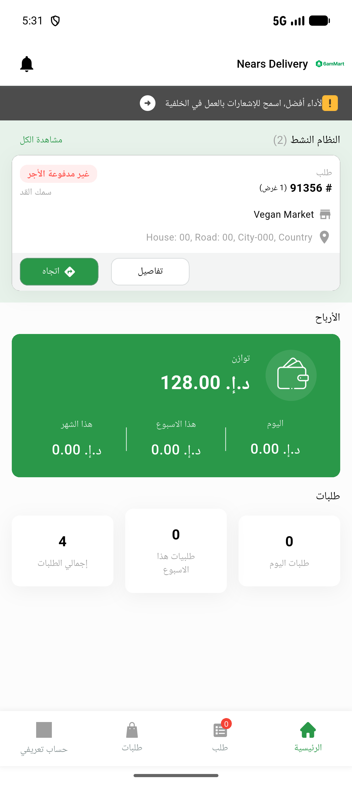

# QA Evidence — NEARS-3554

**PASS - DeliveryApp misc cluster batch 2 (AC1 translated invalid-phone snackbar, AC2 dashboard/splash decline confirmed, AC3 lazy Firebase Analytics guard verified crash-free absent+present)**

**2 screenshot(s).** Click any thumbnail for full resolution.

<table>
<tr>
<td align="center" width="33%"> ac1 order details arabic rtl</td>
<td align="center" width="33%"> ac3 happy path dashboard after relogin</td>
</tr>
</table>

### Other artifacts
- [`ac1-ac3-widget-test-results.log`](ac1-ac3-widget-test-results.log)
- [`ac1-translation-keys-en-ar.log`](ac1-translation-keys-en-ar.log)
- [`ac2-dashboard-splash-diff-empty.log`](ac2-dashboard-splash-diff-empty.log)
- [`ac3-happy-path-google-services-present.log`](ac3-happy-path-google-services-present.log)
- [`ac3-repro-google-services-absent-clean-boot.log`](ac3-repro-google-services-absent-clean-boot.log)
- [`bug-authrepository-unhandled-firebasemessaging-core-no-app.log`](bug-authrepository-unhandled-firebasemessaging-core-no-app.log)
- [`regression-sweep-analytics-call-sites.log`](regression-sweep-analytics-call-sites.log)

---
*From `nears/docs/qa-evidence/NEARS-3554/` · public-repo scrub policy (no live secrets; verified clean).*
